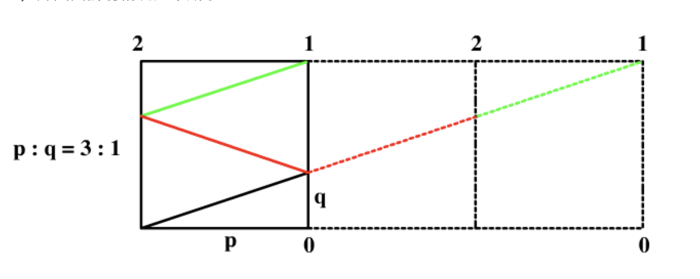
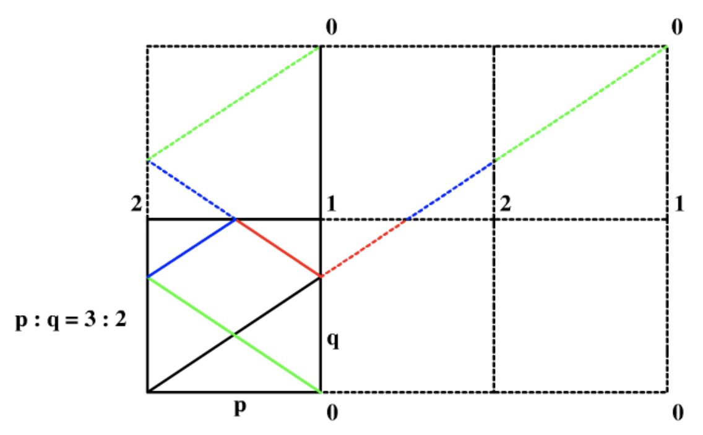

A new month begin!

## Convert Binary Number in a Linked List to Integer

Just same as binary number to a 10-based integer.

First iterate linked list to get the maximum exp. 

Then iterate linked list and each time exp / 2;

AC.

## Insertion Sort List

147.. I have done it before! Please see it in the 147.

## Consecutive Characters

just record the last character and last existing times? It's so easy.

and return the max existing time? O(length)

AC!

## Minimum Height Trees

the result tree has height h. Among all possible rooted trees, those with minimum height (i.e. min(h))  are called minimum height trees (MHTs).

return the max degree's nodes?

I feel like this theory is correct...

Oh my idea is correct? oh...no...there are some difference

It shall be the topology of the nodes' degree.

AC!

## Add Two Numbers II

High precision problem...use linked list to simulate the two sum of two integers

I need to use reversed order it's n^2 if we keep iterating

if n^2 space 

the std use stack...instead we can also just use vector.

C++ class must be **new**!!

AC! This problem let me review how to do the higher precision.

remember the last carry. 

## Binary Tree Tilt

Recursive?

...yes

it's a so easy problem.

## Maximum Difference Between Node and Ancestor

Just record the max value and min value of the subtree?

I think this idea is correct.

AC!

## Flipping an Image

Easy?

AC... just follow the problem ask me to do.

## Valid Square

Given the coordinates of four points in 2D space, return whether the four points could construct a square.

The coordinate (x,y) of a point is represented by an integer array with two integers.

3 + 2 + 1 = 6 edges there are 4 equal edges then

The first node has two choice assuming this node is 0

1 2;2 3; 1 3;

But also angle!!!

Just look std I give up

OH!! std tell us if two diagonal are equal means the angle is 90 degrees!

And determine whether there is two same node!

AC!

## Permutations II

I remember I have done it before. Just let index as the flag which cannot be the same. 

Yes 47. and AC, I review my idea. It's so inefficient!

And coding style is ugly!

Let me revise it.

## Mirror Reflection

There is a special square room with mirrors on each of the four walls.  Except for the southwest corner, there are receptors on each of the remaining corners, numbered 0, 1, and 2.

The square room has walls of length p, and a laser ray from the southwest corner first meets the east wall at a distance q from the 0th receptor.

Math problem huh! long time no problem! let me do it!

It means give a angle at the first time and what is the corner. 

Let me just see the std answer.

std use category discussion

* P = Q 1
* P/Q = 2/1 2
* P/Q = 3/1 1

* P/Q = 4/1 2
* P/Q = 3/2 0

And the std find the pattern. If the P > 1 then we need add P-1 extra room horizontal and Q > 1 we need to add Q-1 extra room verticallly.

Odd P ODD Q 1

ODD P Even Q 0

EVEN P ODD Q 2

## Merge Intervals

56 problem in the regular exercise!

AC!

Just sort and push to the ans one by one...

sort in the all start and end until we find a start > end means a new interval!

## Decode String

Just simulation. I think python is easier to face this problem?

It's not so complicated. It only need to use a stack? yes!

python [start:end] is included start - end+1!

Yes py is easier to process string. But I don't know the effiecency!

