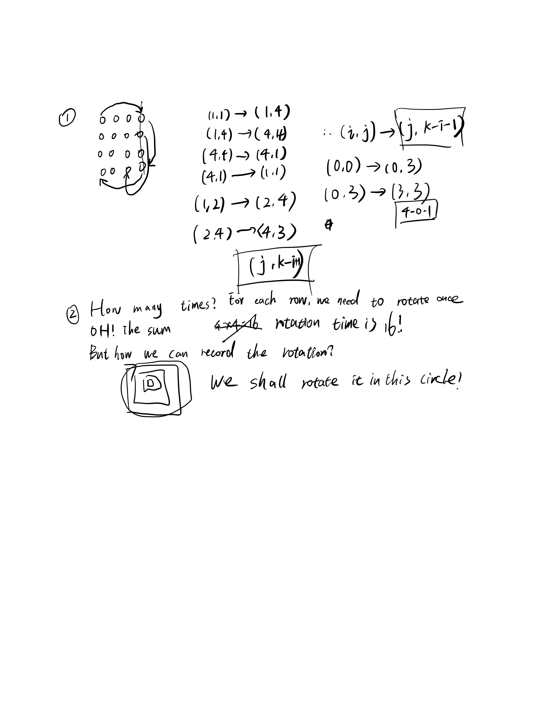

## Stamping The Sequence

Interesting. It's covering problem. We have a string unit. We can paste it to the paper. The question is; if we want to construct a target. 

Also, if the sequence is possible to stamp, it is guaranteed it is possible to stamp within 10 * target.length moves.  Any answers specifying more than this number of moves will not be accepted.

I think this problem we only need to repeat pasting this process.

brute force? We must can find solutions... so if the character is not the same. we paste it again?


Oh my solution has problems. It can start anywhere

for example:

"abca","aabcaca"

we need to satisfy the last 'ca' first.

the std is so beautiful; How can I write these code? First, we stamp it. abca; then it turn to a****ca; attention, it means if we can paste **ca; then we can paste abca. So, we need to reverse our stamp order finally.

a***ca; then we try to reduce our stamp to \*bca; abc\*; we cannot generate ab\*a because if we want to paste it to the target then paste another original, next one must cover the a or other char.

## Palindrome Linked List

Done it befoere! 234!

## Global and Local Inversions

We have some permutation A of [0, 1, ..., N - 1], where N is the length of A.

The number of (global) inversions is the number of i < j with 0 <= i < j < N and A[i] > A[j].

The number of local inversions is the number of i with 0 <= i < N and A[i] > A[i+1].

Return true if and only if the number of global inversions is equal to the number of local inversions.

simulation must be TLE.

we need to try other ways. 

It's a permutation. But this condition is hard to use.

today's thinking is over. I need to use more time. Fuck, the std also do not use permutations.

oh if the local inversions == global inversion, it means besides i+1 no other huge j.

we need to set a mininumber from i+2 - end; if the minimum > A[i], it means besides i + 1 there are some other values which are bigger than A[i].

But maybe this turn fail (Global > local) but in next turn local > Global? The std do not consider this situation? 

Accept but it has to proof that in each number global == local then overall global == local. proof: if these two values are not equal, oh fuck...

the local must < global. Becuase local is one of the global! so it's must be equal in each turn.

## Minimum Operations to Make Array Equal

You have an array arr of length n where arr[i] = (2 * i) + 1 for all valid values of i (i.e. 0 <= i < n).

In one operation, you can select two indices x and y where 0 <= x, y < n and subtract 1 from arr[x] and add 1 to arr[y] (i.e. perform arr[x] -=1 and arr[y] += 1). The goal is to make all the elements of the array equal. It is guaranteed that all the elements of the array can be made equal using some operations.

Given an integer n, the length of the array. Return the minimum number of operations needed to make all the elements of arr equal.

1 3 5 7 ...

let me find the pattern

1 3 5 => 3 3 3; 2

1 3 5 7 9=> 9-5 + 7-5

1 3 5 7 9 11=> 11-6 + 9-6 + 7-6

so we need to calculate it from odd and even.

so odd => n/2*2 + 1 even=> n

AC!

## Determine if String Halves Are Alike

You are given a string s of even length. Split this string into two halves of equal lengths, and let a be the first half and b be the second half.

Two strings are alike if they have the same number of vowels ('a', 'e', 'i', 'o', 'u', 'A', 'E', 'I', 'O', 'U'). Notice that s contains uppercase and lowercase letters.

Return true if a and b are alike. Otherwise, return false.

split by brute force; and prefix sum to compute vowels

oh...if the vowel is a even number we can split it; else we cannot;

just sum all voewl and determine whether it's odd or even.

fuck!  Split this string into two halves of equal lengths, and let a be the first half and b be the second half.

AC...details are important

## Letter Combinations of a Phone Number

Given a string containing digits from 2-9 inclusive, return all possible letter combinations that the number could represent. Return the answer in any order.

Too stupid; just a key value and for loop

17...I have done it before. I use dfs...before.

## Verifying an Alien Dictionary

alphabet is some permutation of lowercase letters.

Given a sequence of words written in the alien language, and the order of the alphabet, return true if and only if the given words are sorted lexicographicaly in this alien language.

It seems used a has to store the order. 

1 <= words.length <= 100 and for each words iterate it, each char's position in the permutation shall be smaller than its successor

##  Longest Increasing Path in a Matrix

I solved this problem a few days ago. It's memrory-based search IF we have gone to this place, just return.

## Deepest Leaves Sum

Given the root of a binary tree, return the sum of values of its deepest leaves.

just record the maxium depth and sum; when new bigger depth happens, restart sum and record the new maximum depth.

Yes AC. Easy today.

## Beautiful Arrangement II

iven two integers n and k, you need to construct a list which contains n different positive integers ranging from 1 to n and obeys the following requirement:

Suppose this list is [a1, a2, a3, ... , an], then the list [|a1 - a2|, |a2 - a3|, |a3 - a4|, ... , |an-1 - an|] has exactly k distinct integers.

If there are multiple answers, print any of them.

if n = 3 k = 1 => 1 2 3 no so 1 3 2

oh for 1 2 3 4

first k = 1

then 1 4 2 3=> 1 3 2 1;

so we move one biggest from end to head the type of substraction + 1.

## Flatten Nested List Iterator

You are given a nested list of integers nestedList. Each element is either an integer or a list whose elements may also be integers or other lists. Implement an iterator to flatten it.

Implement the NestedIterator class:

NestedIterator(List<NestedInteger> nestedList) Initializes the iterator with the nested list nestedList.
int next() Returns the next integer in the nested list.
boolean hasNext() Returns true if there are still some integers in the nested list and false otherwise.

Used a stack and we can ensure the next element must be a integer.

AC! I use deque instead this time. Be careful with the front(). If we use front we must determine whether it's empty or not!

## Partition List

partition it such that all nodes less than x come before nodes greater than or equal to x.

Just iterate all elements in the nodeslist and and put all nodes bigger than x to a new node list.

AC...

But I guess the problem want us to modify the original list not add new linked list? Whatever, even though it need use to modify the original list, it still need use new space to expand the bigger or smaller list.

## Fibonacci Number

The Fibonacci numbers, commonly denoted F(n) form a sequence, called the Fibonacci sequence, such that each number is the sum of the two preceding ones, starting from 0 and 1. That is,

Given n, calculate F(n).

Reallllll? so easy. Just iterate from 2 to n?

AC.

## Number of Submatrices That Sum to Target

Given a matrix and a target, return the number of non-empty submatrices that sum to target.

A submatrix x1, y1, x2, y2 is the set of all cells matrix[x][y] with x1 <= x <= x2 and y1 <= y <= y2.

Two submatrices (x1, y1, x2, y2) and (x1', y1', x2', y2') are different if they have some coordinate that is different: for example, if x1 != x1'.

It seems like a DP problem.

but it may contain duplicates...

The std use prefix sum of matrix.

and enumerate four nodes of sub matrix.

It's basical brute force. let me see more celever solution. 

First, construct prefix sum array by each row;

```
for (int i = 0; i < m; ++i) {
            for (int j = 1; j < n; ++j) {
                matrix[i][j] += matrix[i][j - 1];
            }
        }
```

Pay attention to this, each row is separated for other row.

Second, use i,j to enumerate the columns.

Then we fixed i,j and find row of these columns whether there are zero or!! there are 0-current happens before. Which means, we need to find the current cummulative sum of rows and before sum whose sum is equal to target - current sum;

e.g., we get 1,2,3 we need to find 1, 1,2 whose sum is equal to sum - target.

It's too hard to think this solution.

Enumearte column; Enumearte row, use target - prefix sum to find prefix sum in O(1);

O(N^3) overall.

## Combination Sum IV

Given an array of distinct integers nums and a target integer target, return the number of possible combinations that add up to target.

The answer is guaranteed to fit in a 32-bit integer.

if we know how to combine i from 1..j

and for k from i, 1..j is d[i]*d[j]

for example

1 , 2 (1,1) 5

5*1 

1 + 2 + 2

1*5

1 + 2 + 2

let me see the std;

he use a dp to record how many solutions for a fixed number i.

for above example, 5 can extract to 1 + 4 2 + 3;

therefore we need to sum all these sitautions.

for the 4, it can add by 1 + 3; 2 + 2;

(1, 1, 1, 1)
(1, 1, 2) [1+3]
(1, 2, 1) [3+1]

is three way. Thus, it includes duplicates

Overall, dp[x] += dp[x-a] when a is one of coins;

What if negative numbers are allowed in the given array? How does it change the problem? What limitation we need to add to the question to allow negative numbers?

If there are some negative numbers, our target may need to be excluded of original arary.

holy, if I use int it will hint me errors. But if I use unsigned int, it will show me RE...

I knew it. The problem said that 'The answer is guaranteed to fit in a 32-bit integer'.

However, the answer will > 2^31 - 1; therefore, if we use long, when it out of int, it will hint me RE.

The only way is to use unsigned int. If unsigned int is bigger than 2^31 - 1; it will turn to negative number automatically.

## N-ary Tree Preorder Traversal

Given the root of an n-ary tree, return the preorder traversal of its nodes' values.

Nary-Tree input serialization is represented in their level order traversal. Each group of children is separated by the null value (See examples)

just in the same way?

first add root and left to right.

## Triangle

Given a triangle array, return the minimum path sum from top to bottom.

For each step, you may move to an adjacent number of the row below. More formally, if you are on index i on the current row, you may move to either index i or index i + 1 on the next row.

DP?

Classical. Again and Again. 

DP[i] can be came from DP[i] or DP[i-1]

Follow up: Could you do this using only O(n) extra space, where n is the total number of rows in the triangle?

oh I know. Use the roll array!

remember vector first size then values a(size,values)!!!

AC. use a array to record last row. and substitute it repeatlly.

## Brick Wall

There is a brick wall in front of you. The wall is rectangular and has several rows of bricks. The bricks have the same height but different width. You want to draw a vertical line from the top to the bottom and cross the least bricks.

The brick wall is represented by a list of rows. Each row is a list of integers representing the width of each brick in this row from left to right.

If your line go through the edge of a brick, then the brick is not considered as crossed. You need to find out how to draw the line to cross the least bricks and return the number of crossed bricks.

You cannot draw a line just along one of the two vertical edges of the wall, in which case the line will obviously cross no bricks.

The width sum of bricks in different rows are the same and won't exceed INT_MAX.
The number of bricks in each row is in range [1,10,000]. The height of wall is in range [1,10,000]. Total number of bricks of the wall won't exceed 20,000.

We need to cross least brick. It hint me it will not be huge than INT_MAX. 

I don't know, no insights...this problem is really hard...

Nope this is a easy question. Just use a hasmap to record all nodes' brick's number

I have my own idea!

Oh it's same. Just record the middle cut point.

For example, 1,2,2,1 => 1 3 5 this place to cut is better. we want to more this edge we can cut less bricks!

## Critical Connections in a Network

OH! Tarjand and return all nodes after we shrink circle to a signle node.

Return all dfn[u] > low[v] 's edge!

The tarjan we can read tarjan algorith.

let me use a py std code.

## Rotate Image

I seem to finish this work before.

Yep. 48

## 48. Rotate Image

In this problem, it'a easy question too. It's a long time for no seeing the hard question like the pass days. We keep facing the hard question as a sequence.

I shall not rotate the image instead of making a new one.

we can rotate each element of the matrix and when cover one number and we need to find the conver one's next one.



We use (i,j) -> (j,k-i-1) to represent the evolution.

Also we use loop int the outside of the matrix unitl the inside.

## Furthest Building You Can Reach

You are given an integer array heights representing the heights of buildings, some bricks, and some ladders.

You start your journey from building 0 and move to the next building by possibly using bricks or ladders.

While moving from building i to building i+1 (0-indexed),

If the current building's height is greater than or equal to the next building's height, you do not need a ladder or bricks.
If the current building's height is less than the next building's height, you can either use one ladder or (h[i+1] - h[i]) bricks.
Return the furthest building index (0-indexed) you can reach if you use the given ladders and bricks optimally.

Interesting, first we can know that we have following problems:

a1 a2 a3 a4 is the diff we need to use our tool. We can use ladder to delete a largest one!. Oh I know keep this operation until we have no ladder. and sum exceed of bricks.

OH i know. we need to record the largest one to second largest one...

Yes AC!
## Unique Paths II

 robot is located at the top-left corner of a m x n grid (marked 'Start' in the diagram below).

The robot can only move either down or right at any point in time. The robot is trying to reach the bottom-right corner of the grid (marked 'Finish' in the diagram below).

Now consider if some obstacles are added to the grids. How many unique paths would there be?

An obstacle and space is marked as 1 and 0 respectively in the grid.

Typical DP. first reach the obstacles. And go to end from obstacles.

if we face a obstacles, just continue let it's solution be zero.

AC! 

## Find First and Last Position of Element in Sorted Array

Given an array of integers nums sorted in ascending order, find the starting and ending position of a given target value.

If target is not found in the array, return [-1, -1].

Follow up: Could you write an algorithm with O(log n) runtime complexity?

lower bound? upper bound?

I want to write a strcit ologn, because if all the elements are the same, if we binary search and keep moving will got an o(n)'s worse performance.

pay attention to that: 

···
while (left < right) {
            int mid = left + (right - left) / 2;
            if (nums[mid] < / <= target) left = mid + 1;
            else right = mid;
        }
···

if we use nums[mid] < we can know that if it's equal, the right will be the mid; Thus, it will [left - mid] which means we will get the the most left elements in the end. We need run this process twice with = and not =.