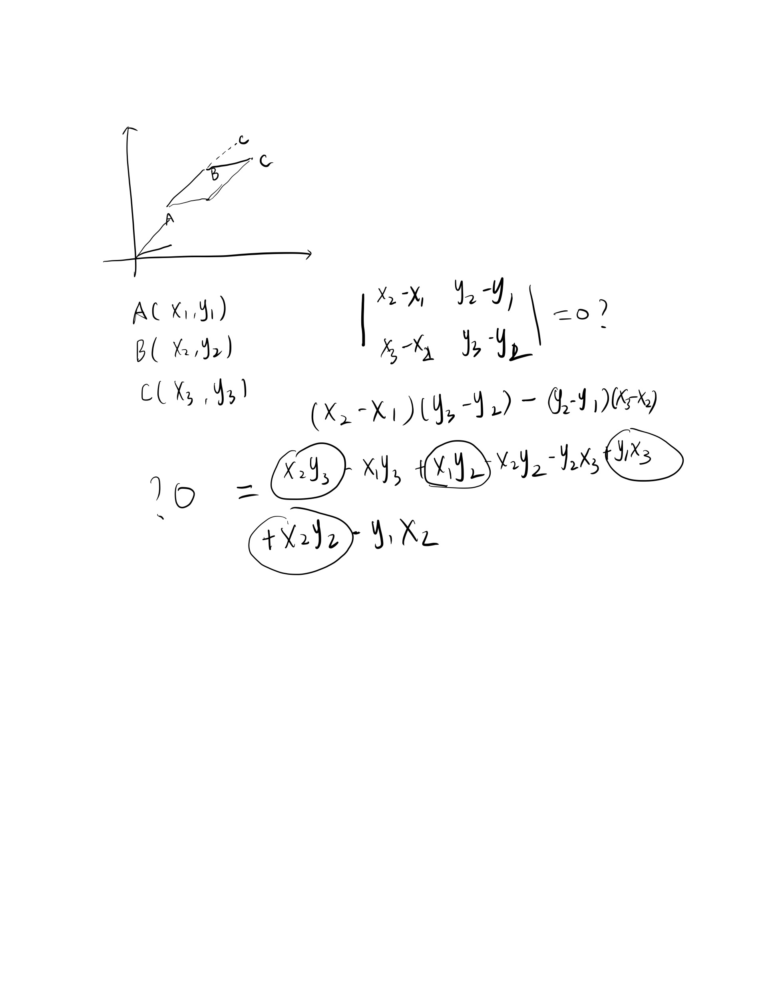

## 149. Max Points on a Line

WE can use brute force and a high efficent method to determine whether in the same straight line

This method is really easy to implement but need the Further Mathematics.