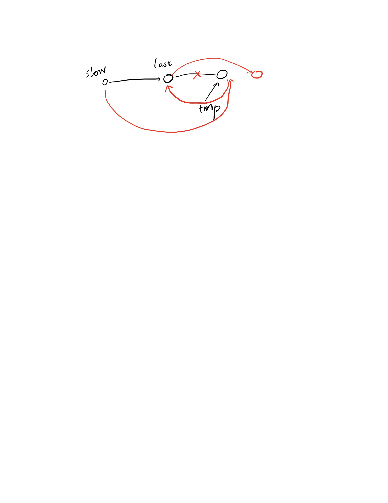

## 234. Palindrome Linked List 

Given a singly linked list, determine if it is a palindrome.

Could you do it in O(n) time and O(1) space?

It's hard to do this problem under linked list with o(1) space

how? head and end. We need to access end in o(n) therefore we only can iterate once

I don't know...

The std give the ansewr

slow fast pointer to find the middle then reverse the back of the linked list. 

last pointer(last) point to the current's next one.

head point to the current

current point to the last

And also, where is the middle slow pointer? 

1 2 3 4 the slow will reach 1

1 2 3 4 5 slow will reach 3

therefore we need to compare in the slow->next pointer

