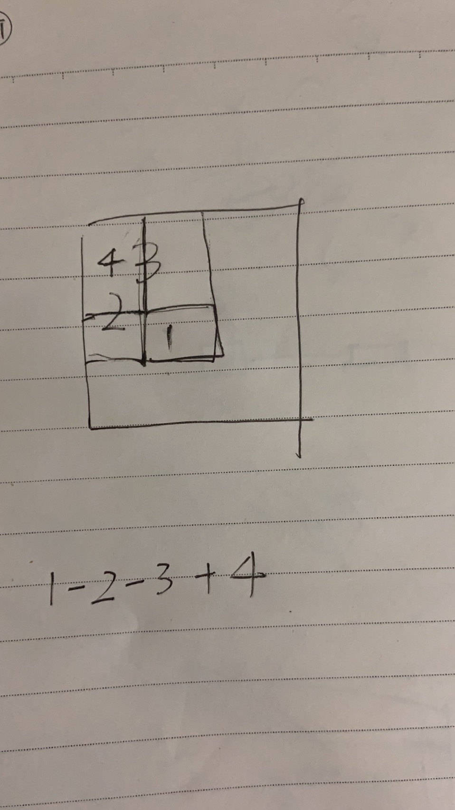

## 304. Range Sum Query 2D - Immutable

Given a 2D matrix matrix, find the sum of the elements inside the rectangle defined by its upper left corner (row1, col1) and lower right corner (row2, col2).

how about giving each row a prefix sum? let me try

yes AC! but a little slow. 

oh, the std use left triangular matrix. we use prefix sum of upper left triangular matrix.  1 - 2 - 3 we minus the 4 twice therefore we need to add 4 again.

1 - 2 - 3 + 4;

