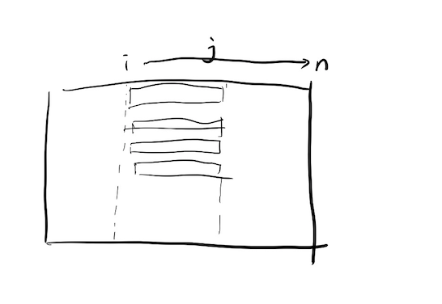

## 363. Max Sum of Rectangle No Larger Than K

Given an m x n matrix matrix and an integer k, return the max sum of a rectangle in the matrix such that its sum is no larger than k.

It is guaranteed that there will be a rectangle with a sum no larger than k.

MAX SUM; How do I solve this type of problem?

m == matrix.length
n == matrix[i].length
1 <= m, n <= 100
-100 <= matrix[i][j] <= 100
-105 <= k <= 105

prefix sum in 2 dimension?

100^4 = 100000000?

but we still need a method like 3 sum?

binary search answer?

let me see std how to solve it.

oh holy, the std use binary search + row prefix sum

the sum array represent the row's sum

at the beginning. we only assign it's the first column's row's sum then first and second's row's prefix sum ... 1,2,3,4 columns's row's prefix sum

Really celever methdos. It's like prefix sum in 3 sum. for example;

we use prefix sum to know the 1-5's sum. And we start from

1-1 prefix sum=>set

1-2 prefix sum=>set

1-3 prefix sum=>set

then if we want to know i = [1..3], if [i-4] can get a value that close to k.

i-4 = [1-4] - [1-i]; thus we can push these values into a set. Then, use binary search, lower bound to find the most close value to k.

we need to use a i to represent start columns and j to represent the cumulative sum's start from i to n; so that a k to represent row.

In this we enumerate all the columns. And our goal is to find all the rows.

