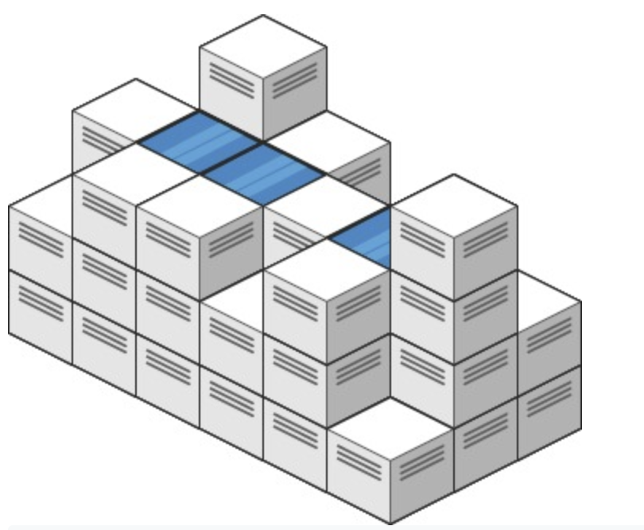

## 407. Trapping Rain Water II

Given an m x n integer matrix heightMap representing the height of each unit cell in a 2D elevation map, return the volume of water it can trap after raining.

this figure has 5 rows and 3 columns.

we need to find a block, all of element wrap it has a value than current maximum value of this block.

Let me see the std...it's interesting

the std use bfs. And because we can find a interesting property. If it can store water, it must be bfs from higher to lower, from edge to center.

how we will count the answer? it must be a block whose around block has been accessed and current block's height < current enumerate's height.

if we use bfs from low to high, it means if there exist some block that never be accessed before and it means we can add the diff to the answer.