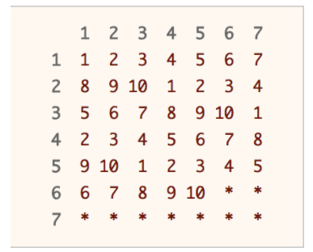

## 470. Implement Rand10() Using Rand7()

Given the API rand7() that generates a uniform random integer in the range [1, 7], write a function rand10() that generates a uniform random integer in the range [1, 10]. You can only call the API rand7(), and you shouldn't call any other API. Please do not use a language's built-in random API.

Each test case will have one internal argument n, the number of times that your implemented function rand10() will be called while testing. Note that this is not an argument passed to rand10().

I seem to come across this problem before. Can we imagine that rand7 will divide a interval into 7 intervals. We need to transfer it to 10 intervals. Thus, we can call 10 times then we have 70 intervals and if it's in the 7,7,7,7...7 each 7 length is probability equals.

This solution is based upon Rejection Sampling. The main idea is when you generate a number in the desired range, output that number immediately. If the number is out of the desired range, reject it and re-sample again. As each number in the desired range has the same probability of being chosen, a uniform distribution is produced.

Obviously, we have to run rand7() function at least twice, as there are not enough numbers in the range of 1 to 10. By running rand7() twice, we can get integers from 1 to 49 uniformly. Why?

A table is used to illustrate the concept of rejection sampling. Calling rand7() twice will get us row and column index that corresponds to a unique position in the table above. Imagine that you are choosing a number randomly from the table above. If you hit a number, you return that number immediately. If you hit a * , you repeat the process again until you hit a number.

Oh holy, that's easy. Why I don't remember it. Since 49 is not a multiple of 10, we have to use rejection sampling. Our desired range is integers from 1 to 40, which we can return the answer immediately. If not (the integer falls between 41 to 49), we reject it and repeat the whole process again. 

