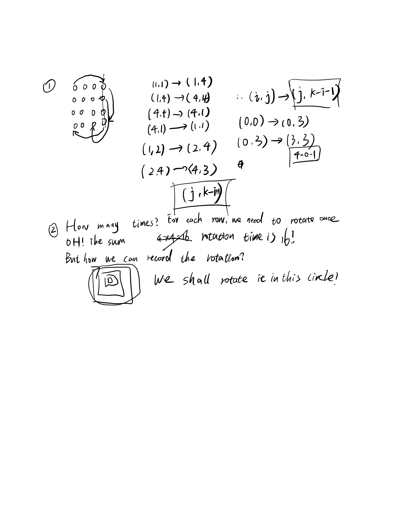

## 48. Rotate Image

In this problem, it'a easy question too. It's a long time for no seeing the hard question like the pass days. We keep facing the hard question as a sequence.

I shall not rotate the image instead of making a new one.

we can rotate each element of the matrix and when cover one number and we need to find the conver one's next one.

We use (i,j) -> (j,k-i-1) to represent the evolution.

Also we use loop int the outside of the matrix unitl the inside.