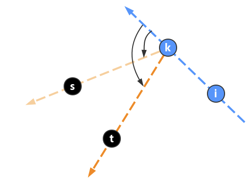

## 587. Erect the Fence

You are given an array trees where trees[i] = [xi, yi] represents the location of a tree in the garden.

You are asked to fence the entire garden using the minimum length of rope as it is expensive. The garden is well fenced only if all the trees are enclosed.

Return the coordinates of trees that are exactly located on the fence perimeter.

It the convex closure problem? Let me learn the usual algorithm to solve it. Gift wrapping，Jarvis march algorithm.

Imagine that we take a flexible rubber band and leave it, it will naturally choose the convex point.

First, we choose a point on the convex hull, and then we choose the point that is closest to the rubber band. We continue to choose the point that is closest to the rubber band, and we continue to do this until we return to the starting point. But how can we find the point at first? We can choose the point with the smallest y-coordinate, and if there are multiple points with the same y-coordinate, we choose the point with the smallest x-coordinate.

So, the next step is we need to find this kind of point continuously. This is the solution
We have a point p now, which is must be in the hull. Then we randomly chooase another point q, and iterate all other point l. we can know that if q is more in the center or to the left side. When it's more in the left side (outside) of the hull, we can no other point is in his left side. So, how to know which point is in the left side? We can use the cross product now. If ks x kt, ks is in the left side which means see the figure below

We can know if s is in the left side, it must has the property that ks x kt > 0. So, we can use this property to find the point in the left side!

The std use a very trikcy way to label the answer. He use a map, all the answer will be pushed into map. And we only put the index in the map/set.

Another question here is the node we have scanned before, do we need to mark it? actually not, if we do not mark it and skip these node, when we turn back to the start point, it means we have closed the hull. So, we do not need to mark it.

Yep, each time we find the candidate and find who has cross product with this candidate and mark all of them as the answer. And we only need to push all the map has marked as the answer in the final answer. AC!