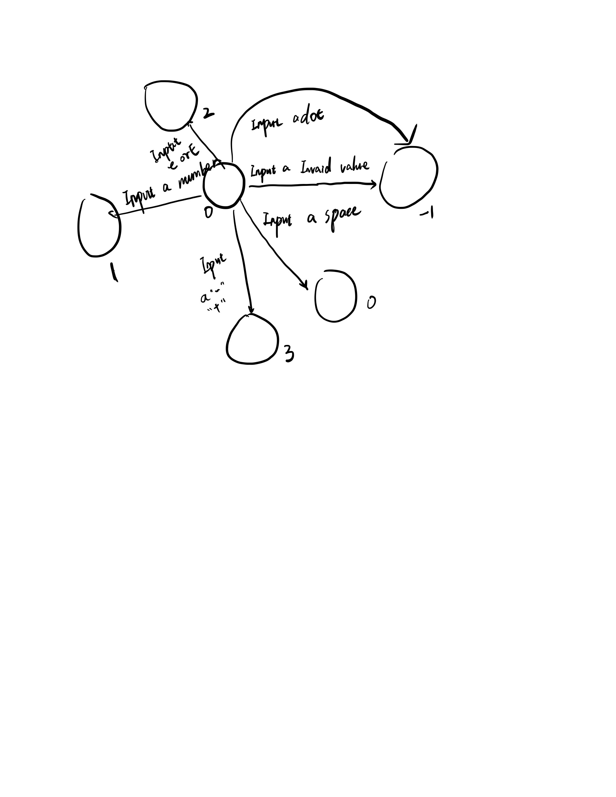

## 65. Valid Number

We need to determine the number is valid or not.
This seems a really really hard problem. We need to use FAM?

We can design a FSM to analysis what we need to transfer to next state after inputting a char or operator. 

```
We have many tranfer operator. 
int transTable[][6] = {
		//0INVA,1SPA,2SIG,3DI,4DO,5E
			-1,  0,  3,  1,  2, -1,//0 represent no input or only space
			-1,  8, -1,  1,  4,  5,//1 represent after a number input
			-1, -1, -1,  4, -1, -1,//2 no number before or only input a dot
			-1, -1, -1,  1,  2, -1,//3 input a symbol
			-1,  8, -1,  4, -1,  5,//4 there is number before
			-1, -1,  6,  7, -1, -1,//5 after a e or E input
			-1, -1, -1,  7, -1, -1,//6 input a e or E then input a symbol
			-1,  8, -1,  7, -1, -1,//7 input a e or E then input a symbol
			-1,  8, -1, -1, -1, -1,//8 after a valid number then input a space
		};
```



This figure shows a simple FSM.

And if we reach -1 then we return false. And We can return ture if we face 1,7,8 in the end of the state.
