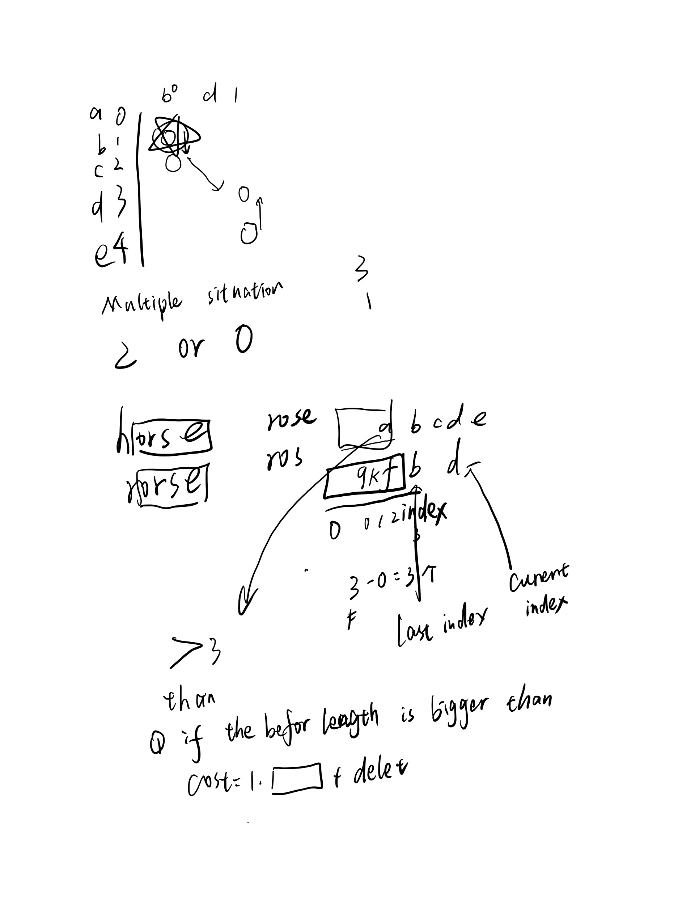
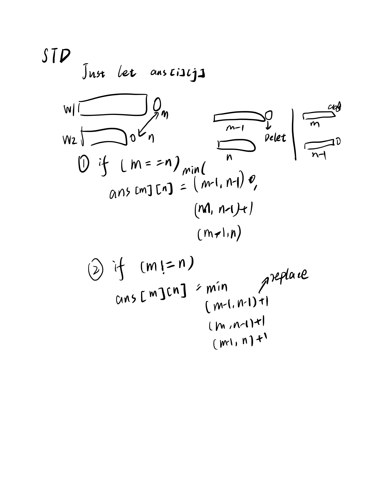

## 72. Edit Distance
In this problem, we need to solve the edit times.
I do this job in a code Similarity detection, thus it's a little easy for me.

we have 3 operations

Insert a character

Delete a character

Replace a character

oh now, It seems a greedy or dynamic programming.

I still think it's a DP. because we need to find a maximum sub string match. Then conduct a Delete or replace.

It not that easy...I am wrong. I need to conduct a LCS first. then Delete LCS not in that edit. 

We have two string org, target.

Assuming we find a LCS string S for them. Then we know there is a part of the target not in S.
for each char we can know how many we need to add. First we use replace other do for the org.
if there is not enough char for us, we cannot use replace operation. Then we can only use delete for redundant char. then we can perform add a character. These operations condcut our answers.

It's my idea.

The standard answer say that we can just take the all questions as a DP.

myidea seems wrong. if we need to match the first char for LCS then it cost will be higher.

Thus we still need to dp the whole question, let me finish it tomorrow.

It's really easy to use DP!!! 
we let f[i][j] means the edit distance for string before i and j. Then we can know the update question shown as below:

