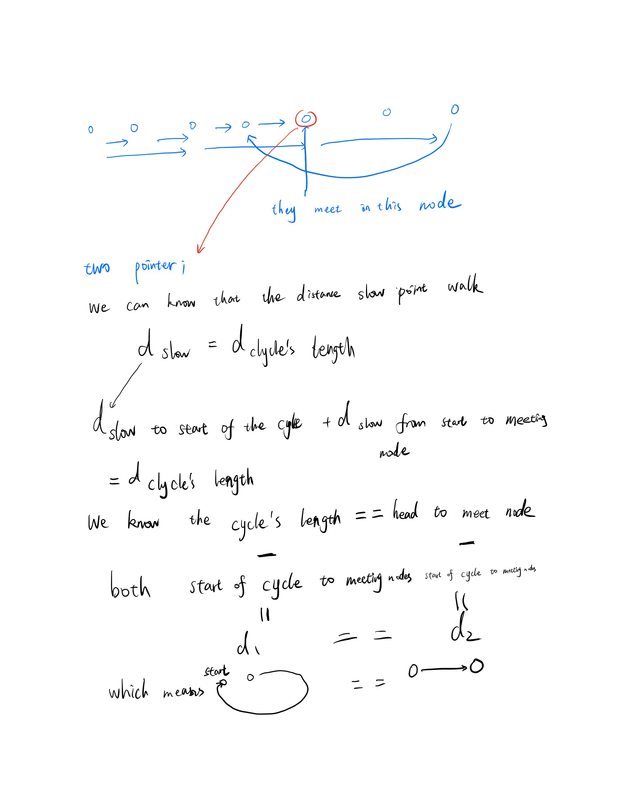
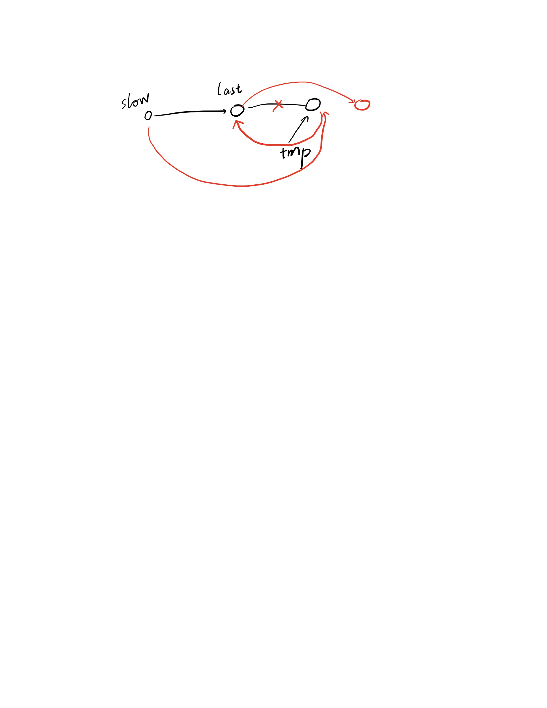
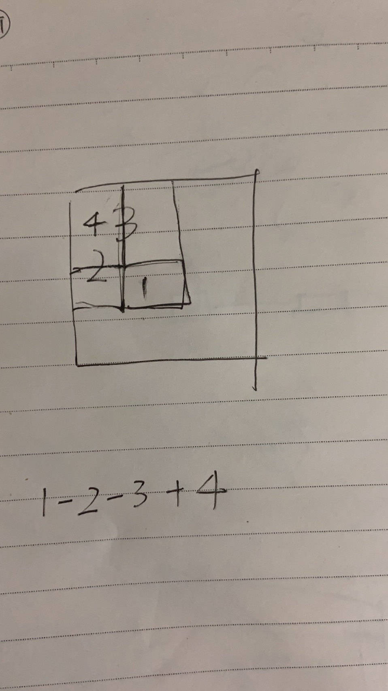

# LeetCode Recording

Practicing my programming skill day by day

Record my insights or std's solution

I labeled problems according to its best solution's algorithm. If there is no fixed type of algorithm, I will labeled it trick (use brain, no template algorithm). Also, if I do not list it in the summary table, it means that the problems are easy enough to finish it in my sophomore.

## Valuable Problems

* Hard to associate them with a fixed algorithm

1. [233]() Number of Digit One
2. [262]() Trips and Users

## Summary Table

| # | Title | Solution | Insights | Difficulty|
|---| ----- | -------- | ---------- | ---------|
|10|[Regular Expression Matching](https://leetcode.com/problems/regular-expression-matching/)| [C++](./Scripts/10.cpp)|[Recursion](./Insights/10.md)| Hard
|11| [Container With Most Water](https://leetcode.com/problems/container-with-most-water/) | [C++](./Scripts/11.cpp)|[Trcik](./Insights/11.md)|medium
|12| [Interger to Roman](https://leetcode.com/problems/integer-to-roman/) | [C++](./Scripts/12.cpp)|[Trcik](./Insights/12.md)|medium
|15| [3Sum](https://leetcode.com/problems/3sum/) | [C++](./Scripts/15.cpp)|[Divide and Conquer](./Insights/15.md)|medium
|16| [3Sum Closest](https://leetcode.com/problems/3sum-closest/) | [C++](./Scripts/16.cpp)|[Binary](./Insights/16.md)|medium
|18| [4Sum](https://leetcode.com/problems/4sum/) | [C++](./Scripts/18.cpp)|[Divide and Conquer](./Insights/18.md)|medium
|22| [Generate Parentheses](https://leetcode.com/problems/generate-parentheses/) | [C++](./Scripts/22.cpp)|[DFS](./Insights/22.md)|medium
|23| [Merge k Sorted Lists](https://leetcode.com/problems/merge-k-sorted-lists/) | [C++](./Scripts/23.cpp)|[Merge](./Insights/23.md)|Hard

## 125. Valid Palindrome

Ignore except char and number. It's easy. I do not know why the acceptance is 30%.

## 126. Word Ladder II

It's an interesting question. We only need to know use the dictionary words to tranfer one word to another target.

I think maybe dfs is the right answer? The std use bfs. I think the dfs the time complexity is almost the same efficiency.

And it need the shortest!!! we can conduct pruning here. We can not bigger than current known answer.

The dfs is great now...but TLE. I need more efficiency.

Oh I understand why bfs is more efficient. Because we need the shortest. If we find a answer. WE can shut down because other answer is not important.

Let me code a bfs tomorrow.

I use bfs but still TLE. I know the difference between my program and std!!! **I iterate wordlist to find the one diff string. But the std use the string.size() * 'a' - 'z'. It change the current string to find whether the modified one existing in the wordlist**.

## 127. Word Ladder
I don't think there is some difference? Just return the answer.size() or zero.

## 128. Longest Consecutive Sequence

Maybe bucket sort? O(n) Or record the consecutive start and end. Nope it isn't O(n). Interval Tree? query -> o(logn) => o(nlogn).

STD is really easy. We can ++ && -- each entry in the array. for example, for 3, we try to find the 2,1, in the array. how do we find it? HashMap => bucket!

## 129. Sum Root to Leaf Numbers

just dfs and stoi done!

Holy faster than 100%. I am really good!

## 130. Surrounded Regions

It's a question about finding the surrounding regions, like the GO game. 

A huge mistake. I let dfs go left and right and left and right... I debug for 30 minutes.

And!!! This method is first find if the region can reach the end. Then we modify the 'O' to the 'X' one by one. And TLE.

**std is really easy. I am a stupid guy. we can know why there are 'O' because it has O in the edge. Therefore we can first let the edge 'O' and its connected 'O' turn into $. Then let 'O' to 'X'. Then let $ into 'O'.   **

## 131. Palindrome Partitioning

I feel a little hard of this question. DFS 2^[length of string]. where to split it.

And remember DP! can we use DP?

THE STD is DFS. 

I think I just use std. I don't want to write dfs again.

The dfs in each turn find the split point from start to the string end.

I thought we can use whether we split in this point or not. It seems like the std program. But more recursive space needed.

## 132. Palindrome Partitioning II

BFS? from split into 2 and split into 3 .... string.length (each char as the palindrome)?

NOPE!! **DP** again! f[i] represent from 0-i the minimum cuts needed.

for [0-i] we can transfered from [0-j] and [j+1,i] and we can know that the minimum cuts can be f[j]

and when f[j+1,i] is a palindrome then we can get the minimum cuts. we for loop all before value. 

Because the ansewr must be transfered from before cut in j and then cut in j!

Also, we use a p[i][j] to record whether it's a palindrome form i to j

and p[i][j] = (s[i] == s[j]) && p[i+1][j-1] 

Then we can update when p[j+1,i] then f[j] + 1

## 133. Clone Graph

It was a recursive clone for each node? I think.

Oh, I understand why this problem is a medium problem. We may have clone this node before. We shall not clone two same nodes.

I add a vector to record the nodes we have cloned.

Yes, this solution is correct. faster than 97.26%.

## 135. Candy

DP!

higher rates => more candies but same rates => less candies

the minimum one => 1 candy. less than left and right => 1 candy

Then we can infer the next position's number of candies.

STD use a very simple way. If the right > left then let right + 1. In this way, we confirm all right > left.

Next, we iterate over right to left to keep left > right. 

**BUT, how to prove this solvment is the minimum solution?**

I don't know, I may prove it some day.

## 137. Single Number II

No extra space. linear time complexity. 

2 2 3 2 we should use the space they give, but how? 

STD!! use bit manipulation that's so complicated.

First we construct three variable one two three to represent how many times 1' happens in a bit.

if a number exists once times, then the one shall be one. twice "one" = 0. Third "one" = 1. We use XOR!
if a number exists twice times, one shall be one and current shall be one! and once "two" = 1 then it will be 1
if a number exists third times, three shall be one when one was one and two was one

then one & ~three (only when three = 1, it wll be zero)

answer is one.

## 138. Copy List with Random Pointer

IT just like the graph. we can also make a node list and record the copy node we have made.

Then STD use hashmap too. Let just copy his code.

He use a node->node to represent the original node and copy node.

then when random pointer it can just use map[orignal node] to get the copy node.

I wonder why the hashmap can record the pointer<->pointer

## 139. Word Break
dfs: one word in dic can be included or not included.

I think using RE in python is more easy to implement DFS.

No, it has some different place, we need to split not cut & merge

Let me see the if the std use dfs. 

And it can use repeatedly for word in dic.

for a string we add xxx xxx xx until we find a word in list. if in we can use it or keep dfs!!!

TLE...in [a,aa,aaa]

std use DP!!!!

STING <-> DP!!!!

Because it satisfy the sub optimal. 0-j it must transfered from 0-i = true and i-j in dic!

## 140. Word Break II

Return all solution.

DFS?

I think a accelerate method. We must match a word first then find next match word!

But I do not know if it can pass.

Let see the std solution.


oh oh oh the std use DFS too. But! it reduce the same computation. The std use a hashset to record the dfs.

oh for example, catsand => cat,sand, | cats, and we put them in the <string, vector<string>> hash set.


Then when facing it again we just use our hashset. It can solve a, aaa, aaaaa, aaaa, because a we have put it in the hash set !

Genius!

## 141. Linked List Cycle

we can set a slow and fast pointer. slow = slow -> next, and fast = fast->next->next

Then, if there is a cycle, it's clear that the two pointers will meet each other.

Yes, accept!

## 142. Linked List Cycle II

Use a hashmap to store the worked node.

yes but it's too slow

It still can use slow and fast pointer



## 143. Reorder List

we can let the last second node's next equal to the current left's next (begin from first node).

And let the current node's original next be assigned to the current. 

AC, but too slow...

## 144. Binary Tree Preorder Traversal

144 need us not to use recursive. Therefore maybe we can record the next dfs node in a dequeu and interation.

OH...it seems incorrect. we need to go to the left before the right.

the right answer is shown as following:

we shall maintain a stack instead of a queue. and we shall push the right then left because left shall be dfs first. then we can push the left's left and right ... until we iterate all left's node.

AC!

## 145. Binary Tree Postorder Traversal

Maybe add a flag stack and first we push root left right and make root as false then we will not add its child again.

YES! AC! But little slow.

OH postorder: left right root; preorder: root left right

we can add root right left and we add as the head then the node we "dfs" finally will be added to the head.

## 146. LRU Cache


THE LRU SHALL evict (pop the first) the oldest -> queue when get this value put it in the queue back.

(actually, in fact we cannot implement LRU because of capacity expand (time) we only can implement a likehood aglorithm "I remember it in OS course in PKU").

YES, the get need to update stack which is O(n). 

There is no both O(1) algorithm?

AND... IF it exist in map, we need to find its queue's place and erase it and push it back again.


STD use a int,list<pair<int,int>>::iterator

get -> pure O(1) (binway nodes delete can be O(1) and add to head)

put -> can be O(1)!!  need to delete the last one (record it?) add to head not exist in hash map
       exist in hashmap, delete it and add to head

## 147. Insertion Sort List

to i th node, we need to interate head to ith, and insert it to the next > value.

**I found that if I do not delete the cycle in the node list (because I do not delete the post->next but I add the next to the place of the sort list, it will TLE (check problem)**

## 149. sort list

I think quick sort and merge sort in linked list is always O(n^2) .

THE merge sort can be logn we can use fast slow point. in 21 we have finished merge two list.

**I found that whatever quick sort or merge sort we shall go to the mid of the list first, then we need to let left and right keep going and exchange the two value.**

## 149. Max Points on a Line

WE can use brute force and a high efficent method to determine whether in the same straight line

This method is really easy to implement but need the Further Mathematics.


## 150. Evaluate Reverse Polish Notation

It's a basic polish notation problem!

Use stack and when facing symbol just + - * / for the stack top and second. When facing numbers please add them to the stack.

Final answer is the top of the stack.

yes! AC faster than 99.68.

## 151. Reverse Words in a String

It's a easy question?

* A word is defined as a sequence of non-space characters.
* Input string may contain leading or trailing spaces. However, your reversed string should not contain leading or trailing spaces.
* You need to reduce multiple spaces between two words to a single space in the reversed string.

py's string operations is really easy. Therefore I use python.

PYTHON [start:end:step] => [1,2,3,4,5] [2:5:1] =>  we select 3, 4, [::-1] reversed the array!!

" ".join([]) we add " " to the interval between each element of the array.

THE answer is threee line!

## 152. Maximum Product Subarray

I think it's a DP problem. enumerate all possible combination?

When seeing the continuous problem, I remember the DP with F1[i],F2[i];
F1[i] represent the included ith element max product
F2[i] represent the excluded ith element max product

F1[i+1] = max(F1[i],F2[i]*V[i+1]); I don't think this DP has optimal substructure!

THE std use this way:
F1,F2 must included the ith element, this way has the optimal substructure
F1[i] represent the max product
F2[i] represent the min product
F1[i-1]*nums[i], F2[i-1]*nums[i], nums[i]

The answer is one of the F[0..n-1]

YES AC!!

## 153. Find Minimum in Rotated Sorted Array

We can just find the rotated point and binary search in the two side.

Oh, it's not to find some number. it just neeed to find the minimum.

just 4,5 | 1,2,3, or 1,2,3,4,5 |

| represent the rotated pivot. we need to find the ascending until descending.

Or the rotated pivot in the end which means no descending and return the first element.

AC~

## 154. Find Minimum in Rotated Sorted Array II

Duplicates？I still can use above 153's solution to solve it.

STD use binary search to solve this two problem.

It's clear that the left mid right
left < mid => min in mid+1-right 
right > mid =>  mid in left-mid-1
else we have the duplicates we need to move right until left != right.

## 155. Min Stack

I plan to write a stack by myself using heap;

Using a array is better than linked list to implement heap...


STUPID QUESTION!!! JUST record the minimum is fine.

BUT WHEN POP? HOW can we find the minimum of the rest number;

OH GENIUS. I think this question is a really hard question.

we shall know that the minimum value is under the bigger value, which means the bigger value do not have the influence. BECAUSE the bigger value must pop first. then the minimum value cannot be the small value.

MY method is a piece of shit. IT's a really easy question.

## 160. Intersection of Two Linked Lists
we need to find the intersection of two linked lists. 

One may be longer than the other one.


I think O(n^2) just enumerate all nodes in A for B

and determine whether this node is one of the B, if it is, then it must be the intersection one.

AC!

## 162. Find Peak Element

I use O(n) to iterate over all elements in the array. 

It seems there is a O(logn) algorithm?

Yes, we can use binary search directly. if mid > mid+1 => the partition maximum in the left-mid or mid < mid +1 => mid-rihgt contains the partition maximum.

## 164. Maximum Gap

1. You may assume all elements in the array are non-negative integers and fit in the 32-bit signed integer range.
2. Try to solve it in linear time/space.

sort is o(nlog(n)) 

we need to find the

I read the std solution, bucket!!! I am really familiar with the bucket!

first we need to get the maximum and minimum of the array

then capacity of bucket is (max - min)/sizeofarray + 1 (I take it as the density)

the number of bucket is (max-min) / capacity + 1

[min..min+capacity] [min+capacity...min+2*capacity] ... [...max]
[v0,v1,vt] [vt+1...]

and we only need to record the min and max and we can know that the difference in the inside of the bucket array cannot be bigger than the differ between the start and end of the two buckets

and we calculate the difference between nearest one and compare it with res.

YES AC!!

## 165. Compare Version Numbers

It's a easy question, but it has some hazard;
first we need to split by '.';

then we get two array which are strings splited by '.'

we need to add '0' for shot strings array

then we begin to compare

we need to delete leading zero for each element of array according to the problem description

Finally we need to transfer the element to the int then we can use < > to compare them

if "equal" then we can move to the next element;

## 166. Fraction to Recurring Decimal

we need to simulate the fraction process of the recurring decimal.

we add 0 to the numertaor 

BUT I don't know how to get the recurring unit

2/3 = 0.(6)

THE std use if the answer has been in the past, then it must be the recurring unit


BUT: what about 0.565 565 565

0.565 565 * 1000 = 565.565
0.565 565 * 1 = 0.565 565

565 = 0.565 565 * 999

565/999 = 0.565 565 

OH I understand!!! we do not need to face the same number of head

for example 565 / 1000 = 0.5 ... 655
            656 / 1000 =     ... 556
            556 / 1000 =     ... 565

this is the same remainder => means recurring not the 0.**5**

## 167. Two Sum II - Input array is sorted

It's a easy question. 

Just enumerate one value then target-value is our "tmptarget"

then binary search the tmptarget.

## 168. Excel Sheet Column Title

Recently, All of problem is easy. return its corresponding column title in excel.

We just neeed to transfer 10-based -> 26-based

/ and % are used to transfer different based;

**attention** because it has 'A'-'Z' => it's a 27 based
                     
                             '0'-'1' => it's a 2 based

we need to / 27!

NO!! 1->'A'; then we can know 'Z'->26; BUT 0??

26->'Z'

26/27 = 0

26%27 = 26

27/27 = 1

27%27 = 0

2=>10

It's so hard...

Let me see the std...

it need to determine whether n % 26 == 0

we can see the std:

```
if (n % 26 == 0) {
                res += 'Z';
                n -= 26;
            } else {
                res += n % 26 - 1 + 'A';
                n -= n % 26;
            }
```

use - % and then use the / n quotient


Z = 26
AA = 26*1 + 1
ZZ = 26*26 + 26

which means we can -1 each time and / and % use 0-25

## 169. Majority Element

we need to find the n/2 interval has this value

we use space to compute but we need space O(n/2)

we can use unordered_map 

AC but too slow... why? because the efficiency of unordered_map?

THE std use moore voting 

if current voting = 0 then answer = current number and voting + 1

if answer = current number voting + 1 else voting - 1

## 171. Excel Sheet Column Number

It's 168's another version...

AA = 1*26 + 1

yes AC! **XXX = (x-'A')*26^Q**

## 172. Factorial Trailing Zeroes

The trailing zeron in the factorial => there must be 10 in the factorial we just need to find how many 10

1*2*3 % 10
1*2*3*4 % 10 = 4
1*2*3*4*5 % 10 = 0 

we just need to find how many 2,5; 10 in the factorial.
2 4 6 8 10
The problem need a log time complexity. 

STD tell us the number of 2 >> the number of 5, we just need to find how many 5

THE STD answer += n/5;

why? 125 => 1,2,3,4,5 ... 125 10/5 =2 15/5 =3 25/5 = 5

 n/5 = the number of 5 in (n/5..n]

 5..25
 5*2 5*3 5*4 5*5 => 5

 25 125
 5*6 ... 5*25

25 - 6 + 1 = 20

It's so strange that the number of five in the (n/5 ... n] is n/5

(a^(n+1) / a - a^n / a) + (a^(n+1) / a^2 - a^n / a^2) + ...

we can know that 5*25 - 5*6 => a^(n+1) - a^n contains a^n * a - a^n-1 * a

a^n - a^n-1's a. but!! there may exist repeat a we need to find the a^n-1 => a^n

a^n-1 - a^n-2 .... => a^n

therefore we know that the numebr of a between a^n - a^n+1 => a^n

## 173. Binary Search Tree Iterator

Just record current iterate place as memory!

The first minimum then we can get the next minimum.

next() and hasNext() should run in average O(1) time and uses O(h) memory, where h is the height of the tree.

O(1) ？？ We only can transfer binary search tree to a array. But it can only use O(h) memory.

maybe we can record the father node we have access

Nope...? I don't know let me see the std

my solution is correct! But my coding is poor. I want to let current can be the next need to return value;

YES AC. It's correct! but my written sytle is poor. 

I need to know that the **let n = node first while (n) {s.push_back(n); n->left} | while (n->left) when n = null then boom!**

## 174. Dungeon Game

DFS? find the maxium final value? if > 0 => 1 is fine or the knight need to be - final + 1

OR DP? jsut F[i,j] = min(F[i-1,j],F[i,j-1])

There is a hazard! in the mid way, the knight cannot be die


DFS is correct but TLE...

It can DP I knew it!! DP with reverse direction from MN to 00

DP[i][j] means how many less blood can be reach in the i,j

therefore i,j <= min(i+1,j,)(i,j+1) - dp[i,j]

## 175. Combine Two Tables

It's a easy question. Use sql and left join.

I used to use inner join. But enven if some one do not have address the question ask us to return name null null.

therefore it's a small hazard.

## 176. Second Highest Salary

SQL just 30 accepted rates? let me do it.

It's easy to select the second highest salary use 1,1; it's hard to return null maybe we need to use if else

we can use if null to let the null value to be set as nulll

**we need to remove duplicates! therefore we need to use distinct**

**we can select * as xxx directly**


## 177. Nth Highest Salary

Recent questions are sql-based! Interesting!

I use a really strange approach declare.

It seems a little bit different with set. 

declare will be assigned in each procedure again.

however, set will only be run once.

## 178. Rank Scores

Today is still a SQL day!

I need to get the rank. A LOOP for it!

For MySQL solutions, to escape reserved words used as column names, you can use an apostrophe before and after the keyword. For example `Rank`.

This is really great hint for debug!

Also we can use DENSE_RANK for problem requirements.

## 179. Largest Number

Return to C++ today

we can know that we need to use a string to represent a integer. 

let big one in the position in the begin.

if there are two same one like 913; 91

we need let 91 be the 911; 913 we can know 913 = 9;1;3 91 = 9;1;1

3 > 1 therefore we need let 913 be the ahead of 911;

let us try this algorithm to solve the.

//if two current number equals

//31 315 we need to choose 315; however when 91 915 we need to choose 915; but if there is a 9 in the number we need to choose 9;

greedy is not correct? we need dfs?

Greedy is correct. becuse in the (//31 315 we need to choose 315; however when 91 915 we need to choose 915; but if there is a 9 in the number we need to choose 9;) 9 cannot be in the 315 therefore when we turn into 3 we can just let 31531 > 31315 

! correct!

I use std's interesting writing style.

use sort and design the compare style of sort

## 180. Consecutive Numbers

SQL today! find all numbers that appear at least three times consecutively.

Interesting. I don't know how to do it...i1 == i2 == i3 The last number ? I seem to do this operation before

oh oh limit? but we need the same? how to do it?

Use multiple table select => the multiplication of these tables (Descartes).

## 181. Employees Earning More Than Their Managers

It's obvious to use left join and find name whose salary higher than its manger!

AC.

## 182. Duplicate Emails

maybe we can left join on the same value and find some value that happens twice!

I also find that we can use group by having count(*) > 1! great!

## 183. Customers Who Never Order
left join and its id == null means it never orders anything?

I was coding in below way. But I cannot select * from (table) where id == null

but we can use `where something in (table)`

Therefore I want to use inner join and where id not in 

OH...I am so stupid. Just id not in orders's CustomerId

It's a really really easy question!

## 184. Department Highest Salary

Two tables; one for employee and one for department. We need to find the max value for each department (contains lots of employees)

The hard place of this question is to choose the duplicate max value.

Maybe we can choose to use join and to select all having the max value one.

It's little hard. Let me see the std solution.

PLS! use **in**; BUT maybe if we contains a value which is not max value in this department but in another department?

THE std is so clever. He select departmentid from first empolyetable and choose whether it is the max in this table which id == this departmentid. he repeat this process and get the ans.

for each id they choose max and use in to determine whether is max and choose all max duplicates.

## 185. Department Top Three Salaries

Last problem same method. However...This version of MySQL doesn't yet support 'LIMIT & IN/ALL/ANY/SOME subquery'

I still look into other's solution. I found that we need to use count(biggher than current salary) < 3 which means its rank is in 3.

Then we need to sort the top 3 through 'order'!

## 187. Repeated DNA Sequences

C++ again!

Write a function to find all the 10-letter-long sequences (substrings) that occur more than once in a DNA molecule.

unordermap? record 11 => 2

the number of 10 length k string is (k-10)

yes...AC

the std transfer string to bit code to save the space. Interesting.

And it seems std use rolling hash to record the string we have record. It's Rabin-Karp algorithm.

Rabin-Karp doesn't means two string is equal when it has the same hash. It still need to compare stirng when hash value is equal because the hash has go trhough the mode operation.

## 188. Best Time to Buy and Sell Stock IV

I can buy k time this time at most, which means 1,2,3, ..., k-1, k intervals maxium for this problem's maxium.

DP? DFS?

for 1 transaction; max(current - past(min));
for 2 transactions; i,j m,n (m>j)

we can dfs...but it may be TLE in high probability.

I look for std...

STD use DP and use two arrays

it define the local[i][j] means we in ith days and we can conduct transactions at most j times and **we must sell stock in j**'s best ans

global[i][j] loose the constraint. We do not need to sell the stock in the j

therefore we can know that

- local[i][j] = max(global[i - 1][j - 1] + max(diff, 0), local[i - 1][j] + diff)

- global[i][j] = max(local[i][j], global[i - 1][j])，

we can global must tranfer from last day global or today's local (sell it in ith day or not)

also local means sell at ith. the local will be tranfered from global j-1, i-1 days + (diff > 0)

And because at ith day we only need to update 1-k for ith and update i+1 from i

therefore we can save space for 1...n days we can just record each day and return the final answer.

AND a optimization for this problem. if K >> size; we can just buy and sell many many times.

We also can use holds and unholds to let buy or not buy can be transfered from (buy or hold)

AC! It's an interesting DP problem.

## 189. Rotate Array

we can know that we need to let last k numbers to the first k


[0,...,N-k-1]
0 => k
k => k*2

[N-k,N-1]

My sol has some problems. If we use last one to push the kthe one then => it may push some value in the last k and cover it...

Also, we can know if we just cover one by one it may go to the same place. how to solve it?

THE STD use reverse ! so clever ... 1 2 3 4 5 6 7 => 4 3 2 1 7 6 5 => 5 6 7 1 2 3 4

in the array we can just swap n-k and swap k => this is easy to do in O(1) space!

## 190. Reverse Bits

When I first see this problem, will the value be overflow?

the easiest solution for this problem is just tranfer to binary and reverse

**PLEASE USE BIT OPERATION**

1101 & 1  => 1 (res<<1+1)
1101 >> 1 => 110

110 & 1 => 0 (res<<1+0)
110 >> 1 => 11

therefore we can know our algorithm is that

res<<1 + n&1
n >> 1

## 191. Number of 1 Bits

Like the above problem. we count the 1 one by one

we let it & 1 and let it << 1 until we find all 1;

## 192. Word Frequency

holy; bash script...

words.txt contains only lowercase characters and space ' ' characters.
Each word must consist of lowercase characters only.
Words are separated by one or more whitespace characters.

we need to know following operations:

sed `s` means replace  Specific characters and `g` means replace the cache `^$` means nothing between start ^ and end $

uniq -c can output the number of duplicates one

The awk command programming language requires no compiling, and allows the user to use variables, numeric functions, string functions, and logical operators.define text patterns that are to be searched for in each line of a document

Therefore, we know after uniq-c we get $2 $1 the word and its numbers

then print it and sort it by n(string to number) r(ascending) k2(key is the second value)

cat words.txt | sed 's/ /\n/g' | sed '/^$/d' | sort | uniq -c | awk '{print $2, $1}' | sort -nrk2

## 193. Valid Phone Numbers

BASH again.

You may assume that a valid phone number must appear in one of the following two formats: (xxx) xxx-xxxx or xxx-xxx-xxxx. (x means a digit)

we may need to use regex? therefore the regex in the shell!

grep -P means Perl regex!

we can grep a file directly.

## 194. Transpose File

one-hot in bash... fantastic

awk is for each line

then we in awk (for) use another for we can store each column in a array

this line 1 col in s[1] 2 col in s[2]
next line 1 col in s[1]

therefore s[1] store all col

then output s[1] as a line finish transpose!

So clever!

## 195. Tenth Line

BASH again

output tenth line; if < 10? error? or other mem space value?

awk + NR done?

## 196. Delete Duplicate Emails

SQL today!

delete duplicates

just see std and learn it.

JUST use delete and from two same table and delete email equal but id > id

DELETE p2 FROM Person p1, Person p2
WHERE p1.Email = p2.Email AND p2.Id > p1.Id;

DELETE FROM Person WHERE Id NOT IN
(SELECT Id FROM (SELECT MIN(Id) Id FROM Person GROUP BY Email) p);

## 197. Rising Temperature

Just compare today with the day before?

SELECT w1.Id FROM Weather w1, Weather w2
WHERE w1.Temperature > w2.Temperature AND DATEDIFF(w1.Date, w2.Date) = 1;


It clear to do this work by DATEDIFF!

## 199. Binary Tree Right Side View
Return to normal algorithm problem today!

we only want to get the right side of the tree today.

I forgot it. A very similar problem. We can just put the elements in the queue in each depth of a tree.

And a tips **height  = depth + 1**

## 200. Number of Islands

Union set? Or bfs and give some flags?

yes, bfs is correct. Flag each node of the graph as -1 and bfs each time and iterate to find the next '1' of the graph.

## 201. Bitwise AND of Numbers Range

the bit of each number can and together.

0
1
10
11
100 4
101
110
111
1000 8
10000 16
32
64
2 4 8

I found that it's clear that the interval contains the 

if there are 2^n and 2^(n+1) in the range then we can know the reason!

if the length(binary form of start) - length(binary form of end) >= 1 which means it's zero!

If else then we need to compute start-end's answer;

AC!

## 202. Happy Number

number equals 1 (where it will stay), or it loops endlessly in a cycle which does not include 1. Those numbers for which this process ends in 1 are happy numbers.

19

1^2 + 9 ^ 2 = 82

8^2 + 2 ^ 2 = 68

6^2 + 8 ^ 2 = 100

1 + 0 + 0 = 1

map and find 1?

YES...It's a easy question.AC.


**USE slow and fast pointer to find the cycle!**

## 203. Remove Linked List Elements

Boring and easy...

AC...

Acutally, there are some tricks. First, you need to consider

1. head is null
2. head is not null but only one head with specific val
3. head is not null but only one head without specific val
4. there are several nodes in the list, but head with the specific val, therefore you need to find the head whose val is not specific val first. 
5. after above process, if it's null return null
6. else let last = head and current = head->next and begin iteration
7. current->val = val let last ->next = current->next
8. current->val != val, then we can know that last =current and current = current->next

Basically, I think we must consider above 8 situations.

## 204. Count Primes

..? What is wrong with leetcode.

Yes, I write a sieve. But I use a bool array to represent whether a number is sieved or not. AC! And faster than 84%!

## 205. Isomorphic Strings

Record the each char position and compare each char's position is equal to the other string.

AC faster > 5%...

Easy just summarizing the number of existing numbers...

## 206. Reverse Linked List

still easy today...

return a Reverse Linked List

just traverse to end and put it in a new linked list. Again and again.

## 207. Course Schedule

Find a cycle in a graph!

dfs?

WRONG! 1->0 1->7 7->0 there is no cycle! but return false;

see std

oh just add one sentence! just after accessing to this node delete the flag; 1->0; return to 1 then 0 can be false;

in one path!

vector's time complexity << map!

use vector and pronum!!

## 208. Implement Trie (Prefix Tree)

Just take the edge as the char and record a ture or false for each edge to record whether the edge will be final.

## 209. Minimum Size Subarray Sum

Given an array of n positive integers and a positive integer s, find the minimal length of a contiguous subarray of which the sum ≥ s. If there isn't one, return 0 instead.

If you have figured out the O(n) solution, try coding another solution of which the time complexity is O(n log n). 

O(n)? It seems impossible?

prefix sum + enumerate : n*n

Oh, I have an idea...

e.g. 2 3 1 2 4 3:

ans: 

2

2 3

2 3 1

2 3 1 2 > 7 => remove 2 => 3 1 2

1 2 4

1 2 4 3

Use deque instead of vector! and record the current sum of the deque!

AC! 

## 210. Course Schedule II

Topology!

BFS or keep remove the 0 indegree nodes!

Just use a deque to record the 0 indegree nodes.

And push them into the queue. 

And delete the edge from this node

keep above procedure! 

make which course need to be learned fist clear!

## 212.Word Search II

Given a 2D board and a list of words from the dictionary, find all words in the board.

Each word must be constructed from letters of sequentially adjacent cell, where "adjacent" cells are those horizontally or vertically neighboring. The same letter cell may not be used more than once in a word.

DFS?

brute force can pass...


We can use trie. but we need to construct it from the matrix!

let me see the std's solution

oh the std construct a trie for the words
```
void insert(string s) {
    TrieNode *p = root;
    for (auto &a : s) {
        int i = a - 'a';
        if (!p->child[i]) p->child[i] = new TrieNode();
        p = p->child[i];
    }
    p->str = s;
}
```

in the above code, only the end's str is not empty!

and search in the matrix and determine whether it in the trie.

construct trie for words + dfs in the matrix for the trie

## 214. Shortest Palindrome

String problem - Oh Oh DP problem

by adding characters in front of it

Interesting

We need to find the minimum steps to let it be a palindrome.

It's so hard...

the std use two pointers, one pointers at the start of the string and another at the end of the string

and if they are equal, both of them --; otherwise the end--

for example in this way abbac, a-c, a-a, b-b;

In this way we can ensure that from head to where there is a palindrome

but attention **maybe there is no palindrome from head to there, e.g.: adcba a-a d...until nothing, i = 2**

in this case, the "ad" is not palindrome.

In std, we need to determin the whether head-i is palindrome and recall our function again.

## 215. Kth Largest Element in an Array

sort and return?...AC

## 217. Contains Duplicate

just bucket? or unordered_map?

ac...unordered_map!

## 218. The Skyline Problem

what is the red point meaning in the right figure is key to this problem.

the red point is from horizontal to vertical?

the std use a scan method and multitest data structure

multitest 

```
Multisets are containers that store elements following a specific order, and where multiple elements can have equivalent values.

In a multiset, the value of an element also identifies it (the value is itself the key, of type T). The value of the elements in a multiset cannot be modified once in the container (the elements are always const), but they can be inserted or removed from the container.

Internally, the elements in a multiset are always sorted following a specific strict weak ordering criterion indicated by its internal comparison object (of type Compare).

multiset containers are generally slower than unordered_multiset containers to access individual elements by their key, but they allow the direct iteration on subsets based on their order.

Multisets are typically implemented as binary search trees.
```

pair can be used as <first,second>

and the std's solution is as below:

first, we need to put the hight to the heap

then we get the heightest of we iterate over's elements

we record the last highest element

if this time current heighest element is not equal to the pre heightest

which means

1. we walk to the end of one element and the last heighest  has been removed.

2. we add a new element to the the range is becomse more higher

And the ans's x shall be the update's place 's x and ans's y shall be current the heighest value.

I learn two things in this problem

1. multisets means heap
2. we need to observe the problem to find the pattern in the problem!

## 222. Count Complete Tree Nodes

just count it? yes AC...

But we need to use the prpoerties of complete tree

except the last level of the tree other level is full which means we only need to count the last'nodes

we can use this properties

in my way 2^n-1 + last level's nodes is a great solution

however!!! the last level's nodes is hard to summarizing.

Therefore the std use another method to implement this properties.

It summary whether current nodes have left most and right most. If it has it must equal to the 2^h

else just take the left and right as the new tree!

## 219. Contains Duplicate II

Given an array of integers and an integer k, find out whether there are two distinct indices i and j in the array such that nums[i] = nums[j] and the absolute difference between i and j is at most k.

I seem to have solve this problem before?

i to find i-k - i + k?

O(i*k)

better map index value to 

## 223. Rectangle Area

To find the juntion place of two rectangles.

It's like a Category Discussion method. More simplest method?

Let me see STD. I think this problem is a little hard...

First consider the situation without junction

if (E >= C || F >= D || B >= H || A >= G) return sum1 + sum2;

Without junction just compute the (min left - max right) * (min up - max down)

Also **sum1 + sum2 may > INT_MAX** we need let it minus the overlap part first!

## 224. Basic Calculator

Implement a basic calculator to evaluate a simple expression string.

The expression string may contain open ( and closing parentheses ), the plus + or minus sign -, non-negative integers and empty spaces .

I decide to use py3 this time. python string!

1. delete space first
2. **non-negative** integers means we can just use stack
3. the value more be more than 10

It still have negative after we do the minus and add...

AC...just modify my code for each test case, it's so not robust.

I also need to determine last operation is '-' or number to record whether I need to add the last number.

also if it's negative number -- = + +- = -

## 225. Implement Stack using Queues

Review how to use queue in stack. 

Just use deque which is too stronger to implement stack also queue but loose indexing.

It's cheating to use deque in some way.

Let me see std how to solve this problem.

It use two queue


first .... end (need to push_out)

then the core idea of this problem is let push and back agian to get following format:

end first ...

then put the end in the another queue.

in this way we can always get the end element (we do not use two queue, one queue and another element is also great?)

## 226. Invert Binary Tree

Seriously? just let the two turee excahnge recursively

Yes...AC...

## 227. Basic Calculator II

224's * / get!

Use * / first 

then use + -

It seems just add a little for last problem.

I use std to solve this problem.

Later when I face basic calculator III I will do it by myself.

## 230. Kth Smallest Element in a BST

Given a binary search tree, write a function kthSmallest to find the kth smallest element in it.

Interesting! left root right is the order of 

Transfer the BST to array first?

STD use a count to count the number of nodes we traverse!

L L L L L ROOT RIGHT LEFT LEFT LEFT ROOT RIGHT => keep the inorder!

This method is so clever!

## 231. Power of Two

The biggest is 2^31...

or bit operations?

keep /2

AC... yes keep /2 and let the dinumetor * 2 to decide whether it equal to the original number.

AC!

## 232. Implement Queue using Stacks

like the above question one stack to store the first element of the stack.

only pop need to pop all 

Is there any easier solution?

a key property: a stack wo pop out 1,2,3,4 wo push them to another stack *up 4 3 2 1 down* then we pop then push to original stack

the order of these number is the same as original stack. 1 2 3 4 and the new one is 5

so genius! let the first in the top and each time we pop out them to a stack and push the new one in the top of the stack.

## 233. Number of Digit One

The std just find the pattern of this problem

the std give the table as below:

| the number of digits 1 | the number containing 1 | the range of the number |
|  ----  | ----  | ---- |
| 1  | 1 |  [1-9]   |
| 11  | <font color="#dd0000">1</font>0 <font color="#dd0000">11</font> <font color="#dd0000">1</font>2 <font color="#dd0000">1</font>3 <font color="#dd0000">1</font>4 <font color="#dd0000">1</font>5 <font color="#dd0000">1</font>6 <font color="#dd0000">1</font>7 <font color="#dd0000">1</font>8 <font color="#dd0000">1</font>9 |      |
| 1  | 21 |   [10-19]   |
| 1  | 31 |   [20-29]   |
| 1  | 41 |  [30-39]    |
| 1  | 51 |  [40-49]    |
| 1  | 61 |  [50-59]    |
| 1  | 71 |  [60-69]    |
| 1  | 81 |  [70-79]    |
| 1  | 91 |  [80-89]    |
| -  | to the three digits |      |
| 11  | 100 101 102 103  104  105  106  107  108  109 |  [100-109]    |
| 21  | <font color="red">11</font>0 <font color="#dd0000">111</font>  <font color="red">11</font>2  <font color="red">11</font>3  <font color="red">11</font>4  <font color="red">11</font>5  <font color="red">11</font>6  <font color="red">11</font>7  <font color="red">11</font>8  <font color="red">11</font>9  |   [110-119]   |

first, let (it + 8) / 10

we use two aid variables a and b

b += n % 10 * a


124

----

132/10 *1 + 0 = 13

b = 1 + 4*1 = 5

a = 1*10 = 10

132 / 10 = 13

----

21 / 10 * 10 + 0 = 20

b = 5 + 3*10 = 35

a = 100

n = 13/10 = 1

----

(1+8)/10 = 0 + 35

----

13 + 20 + 35

124


(n + 8) / 10 * a + (n % 10 == 1) * b;

means n > 2 then left n = 1 then b if n == 0 then nothing !

Let me review this problem again some day. This is a very hard problem!

## 234. Palindrome Linked List 

Given a singly linked list, determine if it is a palindrome.

Could you do it in O(n) time and O(1) space?

It's hard to do this problem under linked list with o(1) space

how? head and end. We need to access end in o(n) therefore we only can iterate once

I don't know...

The std give the ansewr

slow fast pointer to find the middle then reverse the back of the linked list. 

last pointer(last) point to the current's next one.

head point to the current

current point to the last

And also, where is the middle slow pointer? 

1 2 3 4 the slow will reach 1

1 2 3 4 5 slow will reach 3

therefore we need to compare in the slow->next pointer



## 235. Lowest Common Ancestor of a Binary Search Tree

LCA! Come on!

I don't know how to solve this easy problem...

Let me see the solution.

Use BST's property... I keep thinking solve the problem of LCA

if p,q in the left and right which means the answer is current root

Or we can keep searching left or right

## 236. Lowest Common Ancestor of a Binary Tree

compare to the above problem, this problem cannot determine the order of the element I input into the problem.

So we cannot determine the like 235. how about use two extra array to record their parents?

I want to use unordered_set to record the p's parents

and use a array to record the q's parents and reverse the the q's parents and determine whether q's parents one by one in the unordered_set of p;

It need more space.

Let me see the std's solution.the std write 1 recursion and its solution seems easier.

First for the current node, if p in its left tree and q in its right tree which means the current node is the LCA.

therefore we can use LCA to determine whether there is p || q in the left or right tree

```
TreeNode* lowestCommonAncestor(TreeNode* root, TreeNode* p, TreeNode* q) {
       if (!root || p == root || q == root) return root;
```

```
TreeNode *left = lowestCommonAncestor(root->left, p, q);
TreeNode *right = lowestCommonAncestor(root->right, p , q);
```

if left and right are not null whcih means we find the left p and right q therefore the root is the answer;

if onyl left or right is not null then we only need to return left or right whcih means we cannot find in the right or left p and q. We need to left the subtree keep finding the LCA. 


## 237. Delete Node in a Linked List

Seriously? Boring. Next one.

Wait??? No HEAD??

node = node->next?

YEH AC... A little Brain Teaser

## 238. Product of Array Except Self

It's guaranteed that the product of the elements of any prefix or suffix of the array (including the whole array) fits in a 32 bit integer.

Just get the prefix value and divide it.

Yes, but if we face 0!! we need to pay attention to it.

We record the number of zero. Using
```
if (nums[i] == 0 && zero == 1)
    ans.push_back(pi); //there are none zero outside
if (nums[i] == 0 && zero > 1)
    ans.push_back(0); //there are zero outside
if (nums[i] != 0 && zero >= 1)
    ans.push_back(0); //there are zero outside
if (nums[i] != 0 && zero == 0)
    ans.push_back(pi/nums[i]); //there are none zero outside
```

## 239. Sliding Window Maximum

Montone Queue? Yes... Kidding me.

Core idea: higher value 

3 -1 -3 5

[3 -1 -3]
When 5 comming pop out -1 -3 because they will never be the maximum value!

Yes AC!


## 240. Search a 2D Matrix II

Write an efficient algorithm that searches for a value in an m x n matrix. This matrix has the following properties:

Integers in each row are sorted in ascending from left to right.
Integers in each column are sorted in ascending from top to bottom.

O(n) get row logn search

O(nlogn)?

Review lower bound again! I implement it by myself.

size == 0! classic!

the first size == 1 the second size == 0! classic!

Tester! AC

But I do not use the column is also ordered.

Let me see std how to solve it. 

```
class Solution {
public:
    bool searchMatrix(vector<vector<int> > &matrix, int target) {
        if (matrix.empty() || matrix[0].empty()) return false;
        if (target < matrix[0][0] || target > matrix.back().back()) return false;
        int x = matrix.size() - 1, y = 0;
        while (true) {
            if (matrix[x][y] > target) --x;
            else if (matrix[x][y] < target) ++y;
            else return true;
            if (x < 0 || y >= matrix[0].size()) break;
        }
        return false;
    }
};
```

it begin in the left down. The only problem whether the ans in its left. If target is smaller we up, bigger we right. Because, the bigger menas it will never show up in ths column must go right. smaller means it will never show up in this row! make sense!

## 241. Different Ways to Add Parentheses

The only solution I can learn is to use dfs.

1-k; k-n; => 1-q,q-k and k-p,p-n

and remember the symbol

Also review c++ switch case 

...In my way it's the different paraenthese's value. Therefore the duplicated values are approved.

then keep use this way to add parenthesis.

YES AC!

## 242. Valid Anagram

Anagram means the same characters different order.

Use map to record the number of char! and let --;

## 257. Binary Tree Paths

DFS to find all root-to-leaf paths.

Just easy. Record the path and add a char to the string and return it.

AC!

## 258. Add Digits

Given a non-negative integer num, repeatedly add all its digits until the result has only one digit.

when its string format's length > 0, we keep sum all the values.

## 260. Single Number III

Given an integer array nums, in which exactly two elements appear only once and all the other elements appear exactly twice. Find the two elements that appear only once. You can return the answer in any order.

how do we solve single number? just use the xor! This 'Bit Manipulation's method is hard to understand.

The solution still is intelligent but hard to understand. first we perform xor can get the diff two element's xor results.

Then we need to find a object: use the xor results to get a distinguish condition for this two element

condition 1: a = a xor this element;
condition 2: b = b xor this element;

then we can get a and b. BUT how to diff this two element by the xor result? diff' = xor result & - (xor results) to get the 1 which is the 1 in the most right side. The minus value in the computer means the complement code. and we only need to 1001001
0110110 + 1 = 0110111 & 1001001 means the first 1 in the right. GOTCHA!

## 262. Trips and Users

Holy! SQL today.

The Trips table holds all taxi trips. Each trip has a unique Id, while Client_Id and Driver_Id are both foreign keys to the Users_Id at the Users table. Status is an ENUM type of (‘completed’, ‘cancelled_by_driver’, ‘cancelled_by_client’).

Write a SQL query to find the cancellation rate of requests made by unbanned users (both client and driver must be unbanned) between Oct 1, 2013 and Oct 3, 2013. The cancellation rate is computed by dividing the number of canceled (by client or driver) requests made by unbanned users by the total number of requests made by unbanned users.

For the above tables, your SQL query should return the following rows with the cancellation rate being rounded to two decimal places.

1. find the ubanned users
2. group by request at
3. group by status.sum()/ the same group

First, I want to know why the std do not consider the driver need to be. Then I found that the std use USER table which include all users (driver and client) as the left table which take all driver into accounts!

BUT in my opinion, **a.users_id = b.client_id still need to be considered this times' b. driver id's banned = NO!**

## 263. Ugly Number

Ugly numbers are positive numbers whose prime factors only include 2, 3, 5.

keep /2 or /3 or /5 or return false!

## 264. Ugly Number II

Write a program to find the n-th ugly number.

Ugly numbers are positive numbers whose prime factors only include 2, 3, 5. 

Iterate and determine? TLE...

prime sieve?

2 3 5 2*2 2*3 2*5 2*2*2 2*2*3

it's the past answer *2,*3,*5

res

res[m1] res[m2] res[m3]

res[m1]\*2 res[m2]\*3 res[m3]\*3

and m1++ if we choose these one to generate a new sample and use it compare with others and choose the minimum!

like sieve! in the heap!

## 268. Missing Number

Given an array nums containing n distinct numbers in the range [0, n], return the only number in the range that is missing from the array.

Follow up: Could you implement a solution using only O(1) extra space complexity and O(n) runtime complexity?

## 273. Integer to English Words

the problem need to be solved in 'three' part.

For example 12345

and we add it every 3 ways: "Thousand", "Million", "Billion"

n/100 n%100/10 n%10 then we analyzed the last two bits again in this way!

## 274. H-Index

Given an array of citations (each citation is a non-negative integer) of a researcher, write a function to compute the researcher's h-index.

"A scientist has index h if h of his/her N papers have at least h citations each, and the other N − h papers have no more than h citations each."

Let M be the length of the paper

2N-h = M

N (> h), N-h <= h

????

In the problem, 3 paper > 3 2 papers (2 != 3-3)

let me see the std solution

The problem's description is confusing. It shall says the other N-hindex paper has index < hindex.

It's a disaster. the problem ask me to do following:

1. >=h ' number = h
2. <=h ' number = papernumber - h

My solution is almost correct.

STD:

1. sort big to small
2. find an i citations[0..i] >= i which means there is h paper >= h and n-h <= h

we only need to find a i citations[i] <= i [0..i] >= i is the answer

BUT...

[3,0,6,1,5,3,3]

there are 5 paper >= 3 3 != 5

no duplicates?

## 275. H-Index II

It's almost the same as above problem?

AC...I resubmit the 274's code.

## 278. First Bad Version

Since each version is developed based on the previous version, all the versions after a bad version are also bad.

[1..n]

divide and conquer? 

yes but st + ed may out of the int;

therefore, I employ long long to finish the sum them.

## 279. Perfect Squares

Given a positive integer n, find the least number of perfect square numbers (for example, 1, 4, 9, 16, ...) which sum to n.

1+2^2+3^2

it's a DP problem or dfs?

n -> sqrt(n)? nope... it may not be the best like 12 = not 9 + 1 + 1 + 1 is 4 + 4 + 4

I suddenly want to use python to solve this problem.

I need to chage it to DP...

AC...yes just transfer the dfs to DP.

## 282. expression add operators

Given a string that contains only digits 0-9 and a target value, return all possibilities to add binary operators (not unary) +, -, or * between the digits so they evaluate to the target value.

I wrote a similar haskell program?

we need to use dfs to perform following things:

1. choose last number need to be operated
2. choose the opertator we need to use

I think use python it's more easy with lower efficiency though I still use c++.

I record cur_position we need to start and select next number; also current expression and current val;

current is incorrect. becase 5+2*3 = 11 not 6\*3!

therefore we can perform calculate in the end;

OH...1*05 is not valid... we only can let 0 be 0

TLE...

"3456237490"
9191

the std use a diff solution instead of stack

for example 35+41\*2, we record the last round 41 and if this time is * then we need to let the value be the 35-41+41*2

ans-dif+dif*2!

and the overflow:

If the first 32 bits are not all 1s, all 0s, it can be judged that overflow has occurred

I give up. I use long long instead.

STILL!!! TLE...

"2147483647" 2147483647

I decide to use std's solution. my code is too ugly. I see the std has a similar solution.

## 283. Move Zeroes

Easy question. Just remove all zeroes from the array.

we can record two array and concat them one for zeroes and another for general numbers.

oh...You must do this in-place without making a copy of the array.
Minimize the total number of operations.

how about exchange? yeah! AC!

## 284. Peeking Iterator

a PeekingIterator that support the peek() operation -- it essentially peek() at the element that will be returned by the next call to next().

this is a confusing problem. what does peak menas? peek means we can select next one?

oh, after reading the solution, I understand the meaning of this problem. we need to use next to get next value. if we run peek we need to store next one into another value and next return this 'another value'. 

the hard part of this problem is how to use next and peek.

if we call next in the peek, we will reorder the array. we need to record the next one.

* call next directly -> return next;
* call next but call peek before return peek's value and update peek to false;
* call peek withou call next just record the next; 
* call peek with call peek and next before just return _value.

## 287. Find the Duplicate Number

Given an array of integers nums containing n + 1 integers where each integer is in the range [1, n] inclusive.

There is only one duplicate number in nums, return this duplicate number.

sum them and - the 1-n's sum?

oh...nope it may be 11

oh...binary search?

How can we prove that at least one duplicate number must exist in nums? 
Can you solve the problem without modifying the array nums?
Can you solve the problem using only constant, O(1) extra space?
Can you solve the problem with runtime complexity less than O(n2)?
 
Can you solve the problem without modifying the array nums? => I cannot sort

I need to binary search and use o(n) to find how many number < this mid

we binary to [1..n]. get the number of numerb < (1+n)/2 through o(n) summary.

## 289. Game of Life

eight neighbors; 

Any live cell with fewer than two live neighbors dies, as if caused by under-population.
Any live cell with two or three live neighbors lives on to the next generation.
Any live cell with more than three live neighbors dies, as if by over-population..
Any dead cell with exactly three live neighbors becomes a live cell, as if by reproduction.

Write a function to compute the next state (after one update) of the board given its current state. The next state is created by applying the above rules simultaneously to every cell in the current state, where births and deaths occur simultaneously.

summary its neighbors dies and lives?

Could you solve it in-place? Remember that the board needs to be updated at the same time: You cannot update some cells first and then use their updated values to update other cells.
In this question, we represent the board using a 2D array. In principle, the board is infinite, which would cause problems when the active area encroaches the border of the array. How would you address these problems?

so, my method is incorrect. because we will update it first and use the update result to update other values.

THE std use more states! becase like we have four rules, we can let 0 -> 4 if there are 3 live neighbors. And 4 will not affect the answer. genius!

## 292. Nim Game

You are playing the following Nim Game with your friend:

Initially, there is a heap of stones on the table. You and your friend will alternate taking turns, and you go first. On each turn, the person whose turn it is will remove 1 to 3 stones from the heap. The one who removes the last stone is the winner.
Given n, the number of stones in the heap, return true if you can win the game assuming both you and your friend play optimally, otherwise return false.

dfs?

or min-max? or it has some pattern?

n-1,2,3 if i have to win in the last 1,2,3=> friend; 1+(1,2,3) (2+1,2,3); which means your friend must loose!

if there is a solution bob can win in the next round; bob will choose this one.

1 <= n <= 2^31 - 1! we cannot use dfs.

yes, 4=> how many we catch, the next one must loose. 

why: if there are (n+1)\*m stones, n is the maximum number we can catch. when we choose x, 1 < x < n; the other one will catch n+1 - x; then it turn into a (n+1)\*(m-1), which means in the end, it turn into n + 1 and you must loose.

## 301. Remove Invalid Parentheses

we only focus () and make the input valid.

std use bfs. 

first how to dertermin it's valid? )( => false; which means we let each left bracket ++ and right bracket --; if we get a negative value in this process which means we get a ) and no (. 

and the bfs will delete all ( or ) in any times. 

```
 string str = t.substr(0, i) + t.substr(i + 1);
                if (!visited.count(str)) {
                    q.push(str);
                    visited.insert(str);
                }
```

if we do not face this string before, we will delete this bracket and push it into the queue.

## 303. Range Sum Query - Immutable

Given an integer array nums, find the sum of the elements between indices i and j (i ≤ j), inclusive.

just record the prefix? let me try.

yes ac. hint: we can put 0 in the prefix sum to let the answer equal to the i,j i start in 0, therefore the answer is j+1 - i which will delete j but include i.

## 304. Range Sum Query 2D - Immutable

Given a 2D matrix matrix, find the sum of the elements inside the rectangle defined by its upper left corner (row1, col1) and lower right corner (row2, col2).

how about giving each row a prefix sum? let me try

yes AC! but a little slow. 

oh, the std use left triangular matrix. we use prefix sum of upper left triangular matrix.  1 - 2 - 3 we minus the 4 twice therefore we need to add 4 again.

1 - 2 - 3 + 4;

