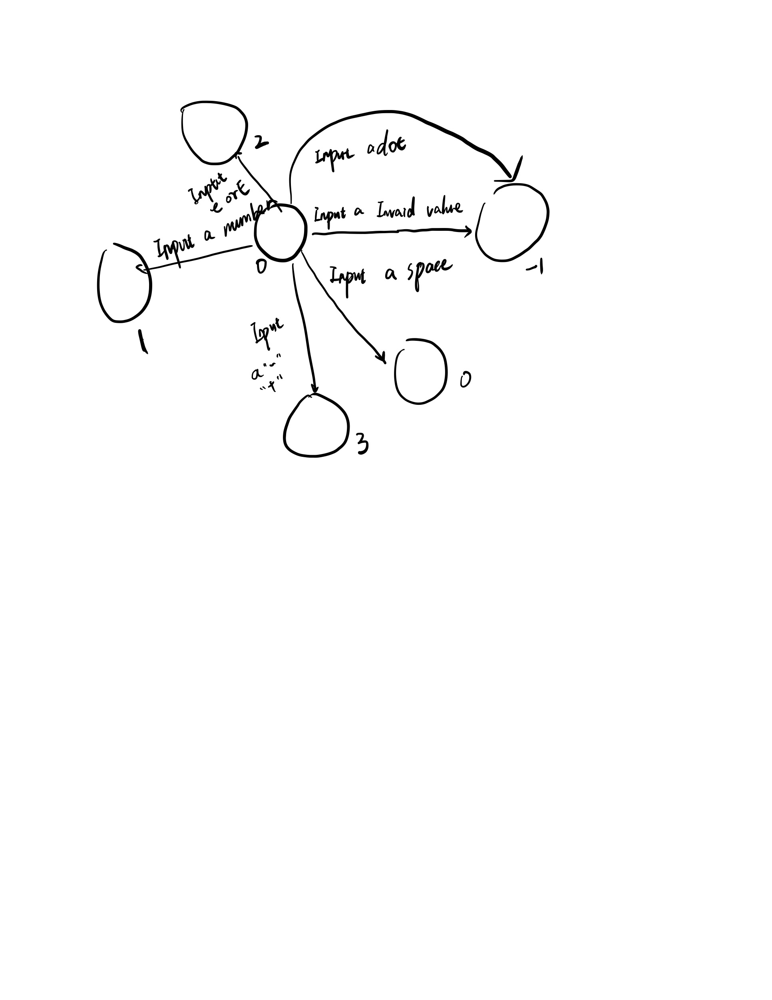
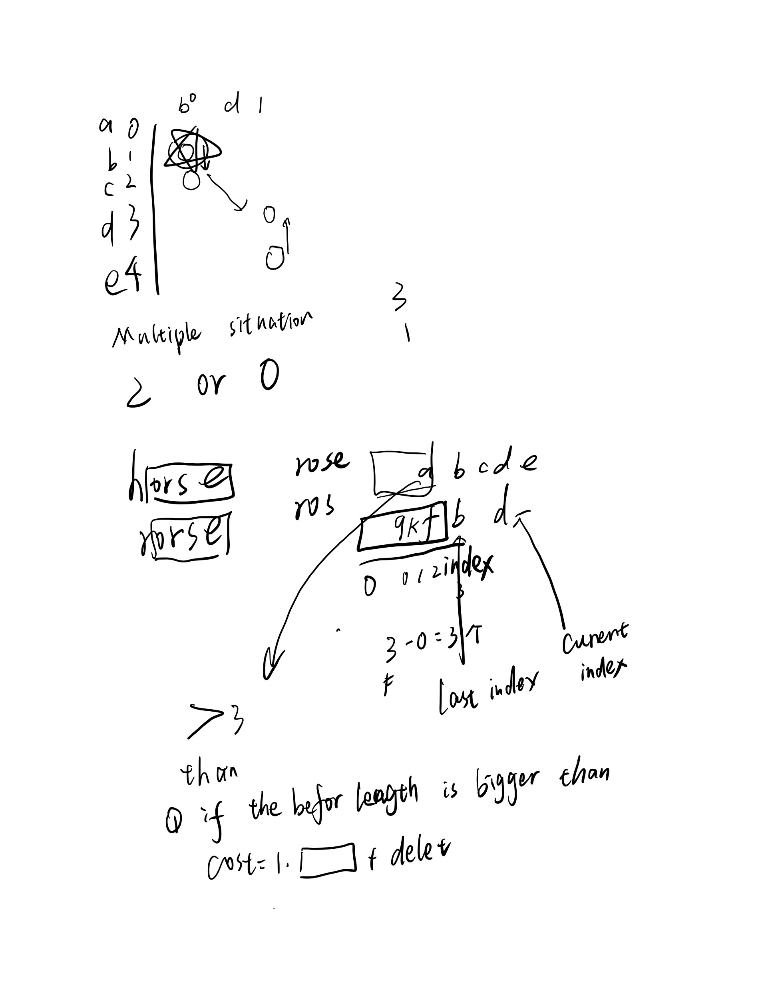
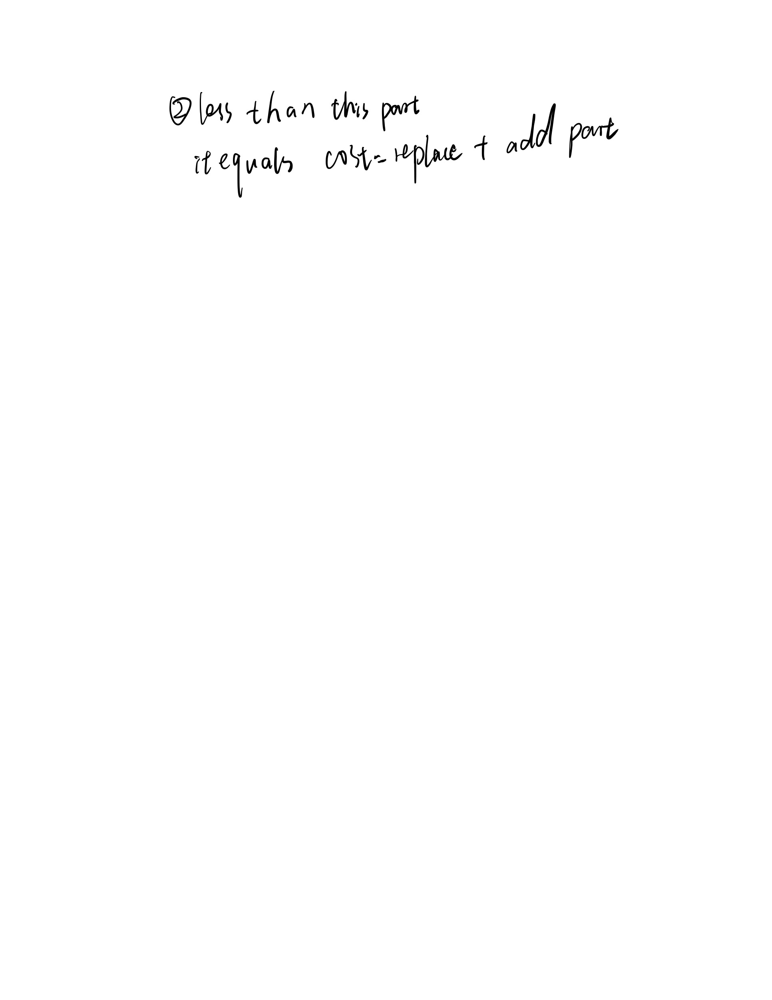
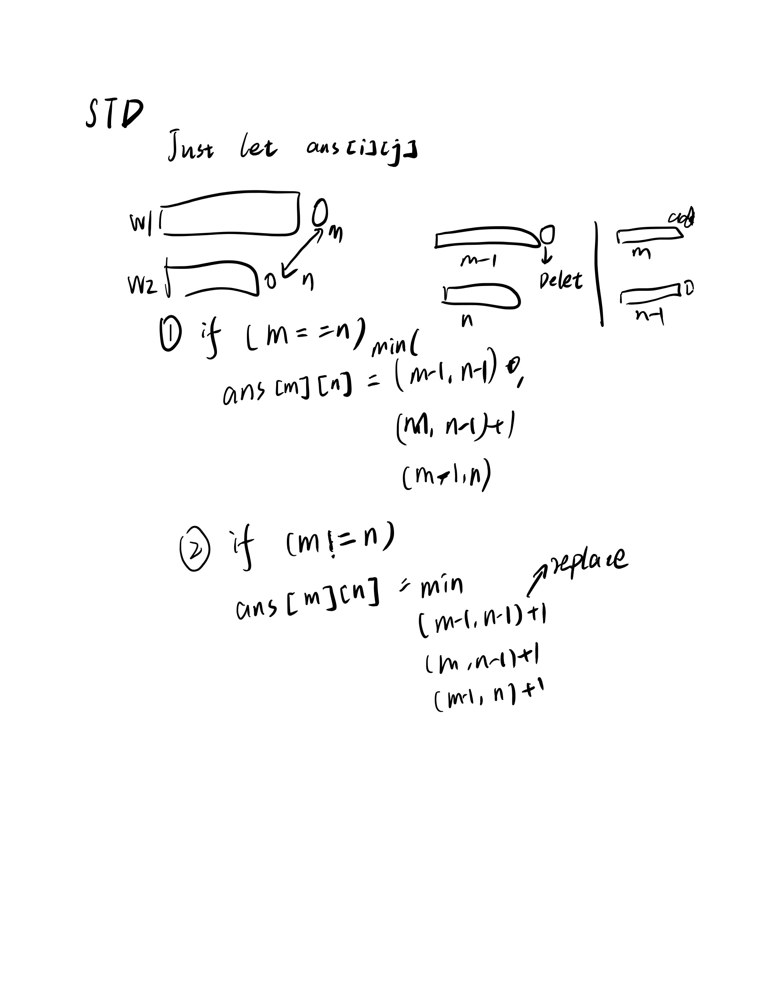

# LeetCode Recording

Practicing my programming skill day by day
Record the consideration and analysis

## 10 Regular Expression Matching
~~Because it just contains '*', '.'.
I think we can detect if there are these two symbols in the pattern string. If there are not these two symbols we can just return whether these two strings are eaqual or not.~~

~~We use a **pointer** to point the position in s we want to compare. We use a **proced** variable to record the previous value for '*'.~~

~~If there is '*', that means we can fit a character with any times; then we repeat the pointer ++ until we cannot find the same one.~~

~~If there is '.', that means we can fit a random character. we can just add pointer;~~

~~If there is a albert, we need to compare it.~~

Then we can program the code in 10.cpp.

However
"aab"
"c*a*b"

Output
false

Expected
true

1. ~~We need to skip if we detect one character~~
2. ~~if the next char is '*' we need to skip too~~
3. ~~If we find all pattern but pointtos < s.length return false~~

Oh oh, it's not that easy; It's a **Recursion** or **Dynamic Programming** exercise. I refer to the **solution**:
I choose to use Recursion, let me figure it out

First if now position is '.' or a char then we can know that we just can match it with the string itself
we can if (p[now] != '*')
            return p[now] in {'.',s[point]} or match(pattern[now+1:],string[point+1:])

if the next position is a '*' 
So we can get zero pattern[now] then return match(pattern[now+2],string) or more than 1, therefore we can return match(pattern,sting[point+1:])

## 11 Container With Most Water

In this problem, it's easy to learn that we can just pick two points and calculate the answer (container water)

It's a n^2 solution.

Let me keep thinking, maybe we can just start from the middle? That's not correct.

Or we can start from the begin and end. Oh yes, we can.

if there is a better solution, we must move the point to the right left,if the value of the left or right is higher than ourselves. But how to calculate whether is better.

Then our complexity is n

We can just calculate the answer is (wide-1) * higer height or original height * (wide)

**BUT** Which point do we need to move? Right or Left?

Let me see, if the large on to move. we have no choice to make a better cotainer. Because the height is decided by the smaller one. and the wide become smaller (because of moving). So we need to move the smaller one. Then we can get the answer.


## 12 Interger to Roman
this is question for a integer that to a Roman
We can can just replace the data with related data.

If the number is < then a value then we should keep replace it. this is a typical replace question
Roman | value 
-----|-------
I	|1
IV	|4
V	|5
IX	|9
X	|10
XL	|40
L	|50
XC	|90
C	|100
CD	|400
D	|500
CM	|900
M	|1000
we can keep reduce until we cannot find a number that bigger than this number in the table.

## 15 3sum
if we just think about the brute force to find the three numbers, the time complexity is

N*(N-1)*(N-2)

It's too expensive. 
Let me think about sort first. Then we get a sorted array. We can just binary search it. (i,j,k)
if we fix an i, then we need to find a j and k, then we know that j + k = -i; we can find the k+i. we can use a bucket to store each value.

But you should pay attention to the existing of the value, Because the output cannot have the same value.

However fail, because it will have the probability to we choose a bucket and value is the same of value of the before value. that N^2 cannot be adapted.
________

Let use 3 pointers.j + k = -i if we point to i first, then we need to find the  j + k = -i if j + k > -i, this is a interesting question. the left + right is the most great sum. becuase the answer must between this two value. j....k. we must adjust the it between this two index. if (j + k) > -i k--; < -i then j++ until j == k;

this means the answer index must between the begin and end in the sorted array. 

## 16. 3Sum Closest
You have to find three number sum closet to the target offer, we can know that the we can use 15 problem

we need to answer close to the target. As the result, we can use a similar method as 15 to solve this problem. 
a+b+c = target a+b = target - c until find a most similar to the target. 

We keep using the o(n2) method to fix a value then find b and c. as the 15 describe.

## 18. 4sum
It more difficult to the last question.

Can we use last algorithms again? That's not true, we must use another algorithm. Because if we use above algorithm, the time complexity is too high.

However, similarly, we can use a+b = sum - (c+d) so we divide it to the 2 sum and 2 sum. Therefore, we can make a preprocess, first, we can add 2 numbers. for n numbers, we can get a C(n,2); pick 2 entity from the array. Then we choose to find a + b = target.

In this question, if I am a person, how to simulate I pick the 4 numbers. I can choose ith, jth (>i), choose k(>j), choose l (>k).

Then we can treat k,l like the 2 sum problem.

Therefore, it is a O(n^3). This is shown in 18std.cpp.

**Attention: Do not let the index out of the array, because leetcode will detect it, however our compiler do not **

However it TLE, we need to optimize it. I found that it's my programming problem, I use another guy's code in 18 std with the smae consideration. Then I pass this problem.

## 22 Generate Parentheses
it seems apparently, we choose a place to add the ();
the begin, inter and end, in this way we can get that:
xxxx
we can search all the answer however TLE...

It's a really simple question...we can just
add a left add a right, and keep the right > current left that's would be right. It's very fancy written style let me analysis it:

If we keep there must be a right < left
first ()
then (()), (()). If we can add a left first, then add the right > left
in the first we add ( -> (( -> ((())) (()(()) this way because we need to go back to find the next standard position

## 23 Merge k Sorted Lists

It's a little easy way, to choose a the min answer in all list, and let the chosen list start point ++;
And repeat until all list has be appended to the answer list.

I think the code is all right. However it show me stack buffer overflow. I need to debug it tomorrow.

However, it's not an efficient way to find the min.

We can maintain a heap to get the min. Each time we find the min, and add the head of the list to the heap each time.

I copy other's standard code in the 23_heap.cpp. (\ref https://blog.csdn.net/Ethan95/article/details/85195403)

I found my problem!!! I decide whether the answer is NULL

original code
```
if (answer == NULL){
                answer = tmp;
                head = answer;
            }else{
                answer->next = tmp;
                answer = answer->next;
            }
```

Code now
```
answer->next = tmp;
            answer = answer ->next;
            current[index] = current[index] -> next;
```

In the before code, I use a NULL to decide a pointer. I think maybe leetcode do not approve that behavior.

## 25 Reverse Nodes in k-Group

I think it is a easy question too. 

We only need to

1. FIRST we traverse the node list, we add the node to a new list N
2. Every time we run k times, we reverse the N add it to a new List ANSWER's tail.
3. We clear the list N. We repeat these operations until we reach the end of the node list.

The hardest part is part 3. We need to reverse the N. We need to reach the end, and scratch the end of the list. And do it again. Unitl there is no end.

Attention! if there is no more enough elements for reverse, then keep its original sequence.

We need to decide whether reverse first then decide whether reach the end (prevent the k is exactly the end.)

## 29 Divide Two Integers

It's easy to think about we use minus replacing the mutil.

7 / 3 = 7 - 3 - 3 
we minus, two "3", thus we know the answer is two.

Attention: please take care of negative numbers and Maximum value. (specially decide)

** Assume we are dealing with an environment which could only store integers within the 32-bit signed integer range: [−231,  231 − 1]. For the purpose of this problem, assume that your function returns 231 − 1 when the division result overflows. **

I need to process overflow also if a huge number divide 1. we need to iterate the huge number times. It will be TLE. I need to find the STD answer.

I need to use BIT operations
The labs() function computes and returns the absolute value of the long integer argument, of the appropriate long integer type for the function. The llabs() function computes and returns the absolute value of long long integer argument.

if we can let divisor << 1 (*2) < dividend then divisor << 1;
So that we can know that, each time we use t*2, t^2*4, t^3*8 to compute the end of the answer. It's a consideration of quick power. and when we end, we know there is a 2^n;

Then we do it again, until we cannot find a more power number for the t.

## 30 Substring with Concatenation of All Words

We know that the we need to choose a substring for each index, st -> st + arbitrary length

However the words list is same length. Therefore, the arbitary length should be number of list * fixed length

Time complexity is O(n) n = length of s; Let do it.

If we only has one char, then TLE, GG.

We need to use another algorithm. 

We compare the each fixed length in the string using for loop instead of HashMap or Trie. I think this may be the problem of the TLE. It still TLE.
Let me keep optimize it tomorrow.

I use two optimization places:

    1. if substring size > end size just break;
    2. we use map assignment operations instead of add each words one by one.

Then the code has been accepted.

## 31. Next Permutation
If we want to understand this problem, we need to know what is permutation.
In wikipedia

`The word "permutation" also refers to the act or process of changing the linear order of an ordered set`

I wrote a python version in my freshman period. We find a discipline in this problem.

First, we find the diminishing sequence in the sequence. Then we reverse the diminishing sequence. And we have known a number before the diminishing sequence. We exchange this number with a number in the diminishing sequence (which is just a lttile bigger than this number, e.g. 3-4,4-5,5-6).

I just use the standard program to submit. Because it is just a regular program, I need to find the pattern or the discipline.

## 32 Longest Valid Parentheses

Given a string containing just the characters '(' and ')', find the length of the longest valid (well-formed) parentheses substring.

It is a parentheses problem again. 

If we use dfs, we only need to add the left parenthesis, and choose if or if do not match right parenthesis. 

Can we use DP? I don't think so. I still cannot know how to decide whether there are Aftereffect.

I refer to the website 
https://www.cnblogs.com/grandyang/p/4424731.html

It's exactly a DP problem. 

Let DP represent the longest parenthesis length before i-1. therefore, the DP[i] can be calculated as length before this symbol.
1...i, we need to find the before symbol, DP[i-1]

if(s[i-1]=='(' || j<0 || s[j]==')') 
    dp[i] = 0;

the i - 1 - dp[i-1] represent the begin of max length of the parenthesis. i-2-dp[i-1]....i-2 i-1

Update formula:

dp[i] = dp[i-1] + 2 + dp[j]

## 33. Search in Rotated Sorted Array
Because the time complexity shall be logN, then I understand that we should use dichotomy. 

It remind me that there is only one point for rotating.
We can use dichotomy to find the unknow point first.

Then we can use dichotomy(binary search) to find the really number we need. 

I have this idea, but it is really hard to implement it. Then I refer to why do not mix two processes, finding the target and finding the rotation point.

If the mid value is less than end, then we can know the the mid to the end is in the ascending order. Then, if target is bigger than mid value, then we need to keep searching in the right. If the target is less than mid we must keep to search in the left.

If the mid value is bigger than the end, we know the begin (e.g, 3 4 5 6 0 1 2) then the right is in the ascending order. therefore if the left is bigger than the target && target is less than the mid value, we need to search the target in the right part of the array. otherwise, we need to search in the left part of the array. 

## 34. Find First and Last Position of Element in Sorted Array

It's really easy if you are familiar with C++ STL. You can use lower_bound and upper_bound function.

!! There is some difference between the lower_bound, upper_bound and this problem. If we cannot find the target we shall ouput -1,-1 instead of the bound~

The upper_bound shall be modified in this problem. Let me finish it tomorrow.

I failed to use upper_bound, we still need to practice binary search.

Let me describe my idea. Let we think about a binary search. If the mid value < target, then we need to find in the right. > left. If equal, then we can record the index and return.

Then we have a index, we need to use while loop to extend to the left and right which is still equal to the target.

Attention to: not found the value and the vector is blank.

### 36. Valid Sudoku

Input is a vector with 2 dimensions. It's easy to use dfs. If we can fill each blank field with any number and each time we need to check the valid features. If we cannot find then return false; else return true;

It seems more easy than it looks. It just need to want to output the valid not to find the solutions.

It has 3 rules:
* Each row must contain the digits 1-9 without repetition.
* Each column must contain the digits 1-9 without repetition.
* Each of the 9 3x3 sub-boxes of the grid must contain the digits 1-9 without repetition.

It's really easy. The difficult part of these 3 questions
is the question 3. how to iterate question 3 ? I choose to first choose (0,0) then (0,3) then (0,6) then (3,0)

### 37. Sudoku Solver

Lastday we need to determine whether the graph is valid or not. Today we need to find a solution.

**You may assume that the given Sudoku puzzle will have a single unique solution.**

therefore, we can use dfs, for a point (x,y) if it's '.' then we need to fill this empty space with a number in range of [0-9] and not appear in the row and column. Let us do it!

The relationship between 36 & 37 is really great. We can use 36's solution to decide whether the 37's current Sudoku problem is correct. If it's right, we can keep searching the next state. If it's wrong, we should return.

## 40. Combination Sum II

It seems like a DFS problem too. Let us user a dfs to find all the answer.

Or we can use Dynamic Programming. let mean DP[i] = how many combinations for number i.

then answer is DP[target].

We initialize the DP[each element of candidates] = 1

OH...OH, there are problems, we will repeat using the candidates. (e.g., 1+2 =3 DP[3] = 1 DP[1] = 1, howevery, the 3 consist of 1, we cannot use 3+1 to conduct 4.)

I still use dfs, then I am accepted...

I think there is a better way to solve this problem.

## 41. First Missing Positive
In this problem, we need to find the smallest missing positive integer in a Given an unsorted integer array.

I need to work in O(n) time and O(1) space. If we use hash function, the space is not O(1). 

**we can use bucket sort in the original array** What do this mean? We use the input vector to do this, we make a[i-1] = i
a[0] = 1 a[1] = 2....

But how can we put the corresponding numbers into the correct position? Well, we can swap it. If the number > length of the input vector, it certainly cannot be the order positive number. Thus, only it less than the n can be swap to the correct position.

**my own code report wrong answer however std is correct** why???

Because once swap is not enough. We need to keep swap until we cannot swap.

In the deep comprehension, the swap time complexity is to find each number correct position. So the time complexity is less than O(n).

**we need to determine whether a[i] > 0 first beacuse a[i] -1 can be overflow**

Done.

## 42. Trapping Rain Water

I think we can just use, for each point as the left wall we need to find the right wall.

And for the right wall we need take it as the left wall, then we repeat this process unitl we find the end of the array.

**attention!! if we do not find the great right wall, then we need let left wall ++ not let left wall be the right wall**

Oh..., if the there is a lower floor like, 3,1,1,3 then the real capacity is 3-1! So we need to let a variable to be the baseline.


Oh..., if the situation is 2 1 0 1 2 then the 1 and 1 will store 1 and 2 and 2 will store 3 therefore the answer is 3 + 1. we need to only calculate the same height.

That's not correct too. We need to flag the last time right wall. If this time we find is the same as the last right wall. we need to still calculate it.

If there are like 3 1 3, if we only calculate 1*(2-0) we need to calculate the (2-0)*(3-1)

Maybe we still need to use the original simulation ways. WALL DOWN UP (STOP HERE)DOWN

It not seems correct. We need to use another methods. Or, we can scan the array first then compare the left and right whihc one is higer. I am a little lazy. Let me keep finishing it tomorrow.

I gave up, this problem in my way, I need to write carefully. I think a more simple solution can make sense too.

OH...someone use stack, whose solution is basical as mine. The solution is genius!

we need to find the down up. and calculate once. Then we find the down up' left and right. Then it would be down up too? if it's we can calculate the rest part which not contain the middle down up. Therefore, we use stack.


## 43. Multiply Strings

It seems to return back to high school. We need to write a algorithm.

We need to use https://en.wikipedia.org/wiki/Sch%C3%B6nhage%E2%80%93Strassen_algorithm to compute the product of two numbers.

**please attention that the number we need to shift when we calculate the product by our hand.**

## 44. Wildcard Matching

It's a difficult question. I need to find a way to match the '?' and '*' characters
Maybe we can use dfs to solve '*' problems!

Yes we can. But, it's TLE. Let me think how to solve this problem tomorrow.

I work for my paper for a long time. Let me finish 44 today.
Wildcard the '*' can represent any number of char.

In the while iterations, if the char of s is equal to the char of p or '?'  then we shall move on. 

When we face a '*' in the pattern, we can use '*' to represent the unmatch character. However in dfs, we use all possible numbers to match the unmatch character. And in the std solution, we use '*' to find the less match. Therefore this match is minimal greedy.  

I find a situation that if the next char shall 
badac
*ac

OH!! I understand if the 'a' cannot match the first 'a', then we use * to match more characters. That's consideration is awesome!

```
while (i < m) {
    if (j < n && (s[i] == p[j] || p[j] == '?')) {
        ++i; ++j;
    } else if (j < n && p[j] == '*') {
        iStar = i;
        jStar = j++;
    } else if (iStar >= 0) {
        i = ++iStar;
        j = jStar + 1;
    } else return false;
}
```

## 45. Jump Game II

Oh, it's a classical problem I have met it too many times. I shall use DP. Let me think the DP state tranfer equation. 
f[i] = update by f[<i], so the steps before one point cannot influence the steps after this point.

TLE.....
IT's an interval cover problem?

[----]

[ ][----]
We can transfer this two jump interval to the

[---------]

It's a binary search to find the last reach point for this problem?

No I still need to search in the internet to find the standard solution.

It's can be implemented with greedy algorithm. 

In 45 cpp we need to scan all of the jump vector and for each jump vector we also need to find the entry of each jum vector. Thus, we only need to find the max of the now and save the scan time!!

In the above std algorithm, we only optimize the each time we do not update the i+a[i]

we only record in this time we can reach the farest point of our jump array.

## 46. Permutations

It's a regular question. However, it need to produce all permutations for the input. which means it's possible that sequence donot contain the original numbers.

Maybe we can permutate the index? Yes, accepted... the medium problem is indeed easy.

## 47. Permutations II

I think this question is a similar question. We can just delete the same sequence. I hope to use hash table to delete the same sequence. Let me try it.

OH...It has been accepted. But I think there is a more efficient way to implement our methods.

OH, I use the index as the dfs key and use dfs to generate an index sequence. However, The std solution use to select a element of the input array. And in the second problem, if we have visited this combinations before, it means we have search this combinations before, the we need to prune. The velocity and time complexity of the pruning algorithm is faster than my dfs all and delete the same sequence.

## 48. Rotate Image

In this problem, it'a easy question too. It's a long time for no seeing the hard question like the pass days. We keep facing the hard question as a sequence.

I shall not rotate the image instead of making a new one.

we can rotate each element of the matrix and when cover one number and we need to find the conver one's next one.


We use (i,j) -> (j,k-i-1) to represent the evolution.

Also we use loop int the outside of the matrix unitl the inside.


## 49. Group Anagrams

In this problem, we hope to classify the same words combinations into the same gropus.

I map to the same string into the same index. I shall use Trie. 

I search in the Internet and find a genius datastructure——unordered_map.

We can use bucket to compute the number of each char. And use this bucket a1b2c3 as the key and a list as the value.  Accept!

## 50. Pow(x, n)
It's a really HARD QUESTION TODAY. I do not know how to solve this. Maybe we can use quick power or something.

So, let us try quick power. We use recursive to implement this problem. 

for 2^n we can compute 2^n/2 * 2^n/2, but, if we compute 2^n/2 * 2^n/2
WE NEED TO COMPUTE THE X N

FIRST WE NEED TO GET X N/2
THEN WE LET RES = X N/2

RES * RES = X N

YES!!! accepted! I am so clever!

## 51. N-Queens

Classical Questios. We can just use DFS.

We can place a queen everywhere until we cannot find a place to place the queen.

I write a really ugly dfs algorithm. Then TLE...

I need to speed it up. 

I shall not use a n^2 loop to place the queen. I need to use to place a queen in current row! Yes! After this way, I pass this problem!

## 52. N-Queens II
It seems like a DP problem. The n = 4 is the solution of the n = 3 let me think of it. 

It must have some law in this problem.

Let me submit 51 again first. Accept...

## 54. Spiral Matrix
Given a matrix of m x n elements (m rows, n columns), return all elements of the matrix in spiral order.

It's a circle shape. I have done this in my high school. We right down left up right .... repeat until no way to go. If we have been to some place, we flag this place true. We need to walk through all nodes.

I do not want to implement it today. It's too basic. Let me explore more efficiency solution. 

Nope there is more complex solution. 

*Attention:this solution we can know that we use a array to represent the up down right left. It really flexible and reconstruct for us.*

## 56. Merge Intervals

How familiar question. In my high school we know about the segment TREE. Maybe using lazy tag? like 1-18 if 1-3 2-6 overlap, 

The most easiest way is to use bucket. 

Oh, I cannot do it in this way. It must happen a overlap problem. If not like [1-4] [5-6] shall *not be* [1-6] *shall be* [1-4] [5-6]

Let me use some sort algorithm.

We can set two arrays. one for start of the interval one for end of the interval.
then one array for storing the start of intervals
one for storing the end of intervals.

we interate the start and end as 0.

if next start (nows+1) > now end (nowe) then we nowend ++ continue find unitl no next start < now end. Then we add the initial start and now end as a interval. Or the end is the last end. we cannot find more end.

Accept!

##57. Insert Interval

It seems a little easy to  use sort and find the start and end of the interval until no cover.

Yes accept! We need to think about three situation, {} represent the new interval [] original interval
1. {[]} continue
2. {[}] record left
3. [{]} record right

As for [{}] it must satisfy both 2 and 3, becuase [ < } and ] > }

Thus we can reduce all these into a interval. And then we insert it into the answer.

## 58. Length of Last Word

We need to find a split string and get the last string.

**several important points**
1. please handle all of the string is ' '
2. please handle the string is ''

Accept！

## 59. Spiral Matrix II

I have finish it before. Just simulate!!!
It's a little easy! Just nail it!

## 60. Permutation Sequence
Use dfs to generate permutations like above question. And break in kth.

Yes, accepted!

## 61. Rotate List
It seems a little easy too.
Repeat simulating in the problem. again and again. Until no more k!

or we can use a "mod" methods. we first reach the tail. and we need to find the
m + n - k%n then we can reach the real position we need to as the tail and head. we just split this place!

## 64. Minimum Path Sum
It's a typical case of DP.
f[i,j] = min(f[i-1,j],j[j-1,i])

Yes accept!

## 65. Valid Number

We need to determine the number is valid or not.
This seems a really really hard problem. We need to use FAM?

We can design a FSM to analysis what we need to transfer to next state after inputting a char or operator. 

```
We have many tranfer operator. 
int transTable[][6] = {
		//0INVA,1SPA,2SIG,3DI,4DO,5E
			-1,  0,  3,  1,  2, -1,//0 represent no input or only space
			-1,  8, -1,  1,  4,  5,//1 represent after a number input
			-1, -1, -1,  4, -1, -1,//2 no number before or only input a dot
			-1, -1, -1,  1,  2, -1,//3 input a symbol
			-1,  8, -1,  4, -1,  5,//4 there is number before
			-1, -1,  6,  7, -1, -1,//5 after a e or E input
			-1, -1, -1,  7, -1, -1,//6 input a e or E then input a symbol
			-1,  8, -1,  7, -1, -1,//7 input a e or E then input a symbol
			-1,  8, -1, -1, -1, -1,//8 after a valid number then input a space
		};
```



This figure shows a simple FSM.

And if we reach -1 then we return false. And We can return ture if we face 1,7,8 in the end of the state.

## 66. Plus One
It's a little easy. Use for loop to simulate the carry a number up.

## 67. Add Binary

Also for big number add methods. Using string to simulate add. EASY!
**Note: PLEASE USE REVERSE STRING AND REMIND THERE IS A MORE NUMBER IN THE END

## 68. Text Justification

I think this is a really easy question. We can use a greedy policy to add words in a line. first we add one word. then we add a space and a word again. If the lenghth > maxWidth then stops. then we have append k words. k-1 space. then we have (maxWidth - k words' length) space to allocate. we can use a loop and each time the k-1 space 1th 2th 3th ... k-1 th space + 1; unitl we use all space to simulate the divide.

If there is only one word in the string we need to add more space in the end. I think this is really simple question.

**append(number,entity) append number*entity in the string or vector**s

## 69. Sqrt(x)
It's just return trunc(sqrt(x))
...

## 71. Simplify Path
In this problem, we need to process the UNIX 
1. Note that the returned canonical path must always begin with a slash /, 
2. and there must be only a single slash / between two directory names. 
3. The last directory name (if it exists) must not end with a trailing /. 
4. Also, the canonical path must be the shortest string representing the absolute path.

For requirement  1,2 we need to add / or Delete redundant slash 

But there is also a .. question.

Oh, I try to use stack to solve this problem. we split it by using slash. If we face a .. we need to pop. if we face a string not "." or "" we push it in our stack.
Finally we output the stack in the reverse order.

## 72. Edit Distance
In this problem, we need to solve the edit times.
I do this job in a code Similarity detection, thus it's a little easy for me.

we have 3 operations

Insert a character

Delete a character

Replace a character

oh now, It seems a greedy or dynamic programming.

I still think it's a DP. because we need to find a maximum sub string match. Then conduct a Delete or replace.

It not that easy...I am wrong. I need to conduct a LCS first. then Delete LCS not in that edit. 

We have two string org, target.

Assuming we find a LCS string S for them. Then we know there is a part of the target not in S.
for each char we can know how many we need to add. First we use replace other do for the org.
if there is not enough char for us, we cannot use replace operation. Then we can only use delete for redundant char. then we can perform add a character. These operations condcut our answers.

It's my idea.

The standard answer say that we can just take the all questions as a DP.

myidea seems wrong. if we need to match the first char for LCS then it cost will be higher.




Thus we still need to dp the whole question, let me finish it tomorrow.

It's really easy to use DP!!! 
we let f[i][j] means the edit distance for string before i and j. Then we can know the update question shown as below:



## 73. Set Matrix Zeroes

I think this problem is an easy question. We can just scan the original matrix and modify it. The reason is that we do not have enough time for scanning the matrix?

I understand what is my fault! if I update it first, there is question! this column's other row can be 0 too then it can be fault.

e.g., 1,2 =0 then we update column 2 all to zero, however we do not know 3,2 = 0 is updated or had been 0, thus we shall do as following:

if it had been 0, we can just mark it in a zero row or column we mark it. like 1 and 2.

This is a constant space but we need to run more interate. 

If we can memoize two array for rows and columns, it turns out to be an easy problem.

## 74. Search a 2D Matrix

It's a easy problem. We can just flatten the matrix into a 1D array. Then use binary search algorithm in the 1d array. DONE.

## 75. Sort Colors

A rather straight forward solution is a two-pass algorithm using counting sort.
First, iterate the array counting number of 0's, 1's, and 2's, then overwrite array with total number of 0's, then 1's and followed by 2's.
Could you come up with a one-pass algorithm using only constant space?

I see this problem and I want to use a bucket array. But I can only use one pass algorithm. 

I see the std and understand. we can record a point for the start of the array, and a point for the end of the array. Then we scan the array, when we meet a 1, we can just ignore. if we meet a 2, we need to swap it with the end of the array, cause it shall be at the end. and if we meet a 0, we need to swap it with the start of the array.

Attention, we still need to find the i-- for this problem. if we swap with the end of the array, we need to search the end of the array again. 

It's a really clever idea.

## 76. Minimum Window Substring

In this question, we figure out a minimum window for this problem. I consider a problem, if we match a char in the target, shall we match it?

let me think about it.  We ADOBEC=>contains ABC but we 

brute way=> find all string

how about recording all the position of the sub-string. if a updated char match, we can delete before character. ADOBECODEBANC
That's wrong, we cannot use greedy algorithms.

First we need use Hashmap to record the target string.

How about using two point. one point is at the start of the match stirng, one point is at the end of the match string. if we find a new match string, we expand the end of the match string and reduce the start of the string. Each time we find the new string, we can compare it wtih the answer string.

when we match the all char in target string, we shall stop and move the start of the string and until we cannot match the target character. And at that point, we shall move the end of the point. Each time we find a new matched string, we can compare it wtih the answer string.

77. Combinations

How about dfs, I think dfs is a good way to 

Attention:

* [1,2] == [2,1], Thus we can just dfs the next one is more than the last one. e.g., [1,2] [2,3].


79. Word Search

Given a 2D board and a word, find if the word exists in the grid.

It's a DFS algorithm again...? if we find the first letter of the word match the matrix, then we can dfs and keep find its neighbors until we cannot match or match the words.

Oh, I search the std, it's a typical DFS algorithm.

80. Remove Duplicates from Sorted Array II

Given a sorted array nums, remove the duplicates in-place such that duplicates appeared at most twice and return the new length.

Do not allocate extra space for another array, you must do this by modifying the input array in-place with O(1) extra memory.

Maybe just scan and record the last one, and only permit the last one show up twice.

81. Search in Rotated Sorted Array II

Suppose an array sorted in ascending order. 

I think we can get the original array back. It contains the duplicates. It's a little difference with 32. for input [2,5,6,0,0,1,2], target 3, it shall output false.

I am wrong, it seems really different with the last one. I understand why we cannot use 33's solution. for example, [3 1 1] [1 1 3 1], the 1 == 1, but 3 can show in the left or the right. 

Std use a simple tricks. we move the right pointer to a different position which do not haec the duplicates.

## 82. Remove Duplicates from Sorted List II
I think this is a simple question. we need to record the last one, if it's the same as the last then delete it!

It's a little complicated thant the below thought. Because it need to remove duplicates, we need to record the last one before the duplicates. Then we need to process if duplicates in the head. Then we need to find the next duplicates ones and delete them and let the back link to the next header. then fidn the duplicates ones after the head.

## 83. Remove Duplicates from Sorted List

It‘s a easy version of last question. we can only need to remove duplicates. I write a wrong version of last question as this question. Therefore, let me write it. we can just delete use *lasttmp* and keep it and delete the duplicates ones.

Yes, **atention in the last we need to determine whether delete or link to the last**

## 84. Largest Rectangle in Histogram

We need to find the largest rectangle in a histogram. This problem really only seems like a above problem. maybe we can choose one pillar and extends to the left and right. Oh...oh, that's correct but TLE. I need to choose another efficient way.

I find that, in my extends method, we need to find the shorter one for the pillar which means we cannot extend. the first mini value for the current pillar.  we need to nlogn. I have an idea.

We can record a bucket array, each one recording the index value corresponding index in the histogram.
e.g., 2 1 5 6 2 3

Then our 2D array is
0->0

1->1

2->0->4
Then we can use O(n) time to do that.

Then we need to find a minimum value for each value. Then we need to find the farest which means the minium position for current value.

for 2 we need to find 1 the 1 position is 1.

Oh, that's seems incorrect. We need to find the least distance, first less value. not least less value.

We need to use a data structure which can find the closest less value.

we seems to use stack is a good choice like above problem. First decrease then increase. or increase directly.

But how can I use stack to finish the find the cloest mini value.

### STD solution
I read the std solution. I found that it push a 0 at the final. 

How can we use a stack to process the array. We can know that the answer if we face a decrease sequence we almost find an answer.
like 4 5 6 5, then we can know we need to process the <5 pillar before this 5. in 4 5 6 5, the 6 5 is decreasing, and there almost are existing an answer. so we need to find in the increase sequece 4 5 6, which one is the most cloest to 5 but > 5 is 5.
then we need to 5 6 5 this be an answer. 5*3 6*1. Then we need to keep processing, becase 4 5 6 5, 5>4, we can keep add value.

But,if we record the height of pillar,we cannot compute the distance. Thus, we record the index. 4,5,6,5; 0,1,2,3, when index 3 coming, 1,2 pop out, then it turns into 0,3. Then because in the first, we add a zero at then final, it must out, then we can know that, the answer 4 can be 0,3,4. (4-0-1)*4 = 12 is the final answer.

## 85. Maximal Rectangle

I need to find the maximum all 1 rectangle in a 0,1 rectangle. Can I use dfs to expansion the all 1 rectangle starting from a point in the rectangle?

Nope, It must TLE. Focus on finding the regular pattern, It's another version of 84.

If we take the column as the x-axis of the histogram, and row as the y axis.

When we face a zero, we just cut it down and let it move to the 0 position. like

1 0 1

1 1 0

1 1 1

for the row, 1 1 0, when we face a 0, we already have a 0 in the third pillar, then in the 1 1 1 in the last row, the last column's pillow shall be 1. Thus, the answer is 2*2. We record a height array, and scan each row. when we face a 1 then let the height[i], this column ++, or if we face a zero, we cannot keep a continuous pillar, then we let the pillar = 0.

## 86. Partition List
Partition it into two list which one is greater than the value and the other is less than the value.

I use a if else to dertermin if it's the first time to build a *less than list* or a *more than list*. I think it will consume a little more time. However it run faster than 91.5% programs.

## 87. Scramble String
I think it's a easy question too. I think I misjudge it again. abcde caebd. In my understanding, if we need to produce a scramble string, we need to cut it, and reverse one of the cut one.
how about tring everywhere in the second string and reverse one of the string?

we may choose any non-leaf node and swap its two children. => the part of the string has been reversed

It seems a clone detection problem. 

wrong example abc bca => true ? why?.... abc => a, bc then it can be bc a.

I thnik maybe in the stack, there are some point we reverse it. I cannot simplely reverse it. Let me do it tomorrow.

Above is not correct!!! becuase it's a binary tree.

This is a typical recursive or dp problem. Think about that, for a string s1 and string s2. If it's scramble which means s1 or s2 has been divided into two strings. s11 s12, s21,s22. For this four string, we may exactly know that the s11 == s21 or s12 == s22. **OR** s11 == s22 s12 == s21 it has been scrambled. But it's not enough, because s11 is not having to equal to s21 or s22, it can be scramble of s21 or s22. Therefore, we can use recursive. This consideration is genius!

## 88. Merge Sorted Array
basical question.

**you should know that you should add it to the nums1** I use insert then nums1's size changed. Thus, I need to use resize to apply for nums1.

## 89. Gray Code
bachelor's course digital circuits. LET me to review it.

The principal: The highest number save and n xor n-1 => n-1

We can use recursive for this problem!

for 3 is equal to 

2's gray code

reverse the gray code array. add 1 to the head

0,2,3,1 => 00 01 11 10 => 110 111 101 100

Remeber add 0 to the head like 0,1 because when I transfer a 0 or 1 to a two-sequence binary, it will not have zero at the head.

faster than 8.35% of C++ online submissions for Gray Code.

## 90. Subsets II
Use 79's solution. But we cannot contain the same combinations.

I accept it. Even though I am little confused. first I sort the nums array. and get 1,3,3,3,....X some array like this. Then I use different situation to dicuss it. If the last one is same as current one. (because I sort it, the last one must be the same as this one or there is no same number for this index.) Then I only consider the last one exists situation. Because if last do not exists, and I fill current one, because I first think about fill a number to the answer array. Then if last one do not exist which means we have choosen the last one in a iteration of dfs. Then I choose a same value in this round but not choose the last same value,which can cause duplicate. Therefore, if the last one is not same the current one, we use regular dfs. If last one is same as the current one, we only dfs when last exists!! (including contain or not contain).

## 91. Decode Ways

It certainly a DP problem. It'a problem of splitting the numbers into the different ways with 1..26 numbers.

1345=> 1,3,4,5 => 13,4,5

Therefore we mostly can divide it into 2 numbers 10-26

xxxxab = xxxxa,b + xxxx (ab)[when ab <= 26 and a != 0]

**atention** there is no 0 in the a-z. which means 40 => 0

OH...NO, I cannot use recursive. I shall use DP which more faster.

F[i] means before index i we can construct.

if s[i] == '0' f[i] = f[i-2] if s[i-1] != 1 or 2 then return 0. because no 00 30 40 ...

else f[i] = f[i-1] + f[i-2]

Yes I accepted by dp. I real recognize how to use DP.

## 92. Reverse Linked List II

Reverse a linked list from position m to n. Do it in one-pass.

count it. It just a code problem. It test your coding ability.

OHOHOH 1pass accept. I carefully think about the count and we need to choose the split part of the link list.

I divided it into whether m == 1 or not == 1.

when m == 1 we only need to reverse it to record the tale and head. each time I add a new one and take this one as head. In then end I connect the tale to element after the n. and return new head. This

In the same way, we link the m to the new head. And we return the old head if m != 1.

93. Restore IP Addresses

Given a string containing only digits, restore it by returning all possible valid IP address combinations.

1-4.1-4.1-4.1-4 is the ip address. 

Thus which can have [0-255],[0-255],[0-255],[0-255]. In this situation, we can use dfs...

First, we try 1,2,3 then keep tring until we try 4 times to represent the 4 ip address.

also, when we try 3 times in each 4 times, to try 1,2,3 digits. 

**attention in std's dfs, it use a &references to represent the answer. it really great to add the change value as the parameter not like me use a global value. And std determine whether it valid in 4 times determination every time.**

## 94. Binary Tree Inorder Traversal

Inorder, typical question, which means left father right, the father is in the traverse's middle.

First we need to traverse left, if there is a left we need to traverse. Then recording the traverse current position. Then record next.

**attention remeber process NULL situation**

It's really easy.

## 95. Unique Binary Search Trees II
I think it's a little hard problem. 
Given an integer n, generate all structurally unique BST's (binary search trees) that store values 1 ... n.

We got a sorted array. Therefore, we only find a interval and let left is the left tree.

I use std code and find that it use c++ 11 perfectly. First when we only have one number it must be a root (the leaf of the last recursion). 

## 97. Interleaving String
find whether s3 is formed by the interleaving of s1 and s2.

It remind me of the befoer problem. We need to find out whether the one of the string is the substring. We need to keep the sequence. I remeber we can use dfs + cut interval. 

This situation seems more complex. Not only we satisfy the order, number and we cannot use two char twice for one string. Because it must belong to one string. 

OK, I have to see the std. 

It...DP again. 

Let me so how DP works. First, s1'length + s2'length = s3'length. And F[0][0] = true for dp array. if one of the array is empty. Then the other one shall be equal to the s3. let us think about the F[i][j]. Which means we use the s1' first i char and s2' first j char and combine them as s3's i+j char. Let us think about it. If we want to know the final answer f[n][m]. the n+m char for s3 must come from the s1 or s2. If it come from s1, then n+m-1 is come from s1's n-1 and s2'm. Therefore it come for f[n-1][m] or f[m-1][n]. 

Thus the equation is dp[i][j] = (dp[i - 1][j] && s1[i - 1] == s3[i - 1 + j]) || (dp[i][j - 1] && s2[j - 1] == s3[j - 1 + i]);.

**attention the string's first index is 0-n-1 but in the dp array begin at 1**

## 98. Validate Binary Search Tree

It's my wechat interview question. The only question is that the all element of left tree shall be less than the root.

Maybe we can generate a binary search tree sequence or repeat use recursive like above questions.

Oh...ps...I am so sorry. That's a really easy question. I think if we can solve it in the wechat interview...I am so distressed. Ugh... That's a really easy question.